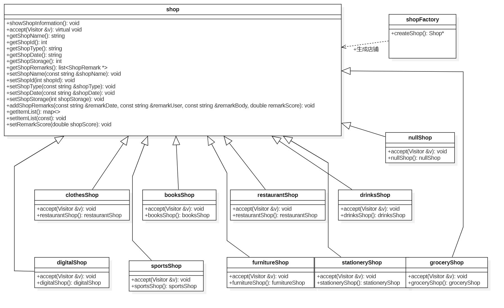
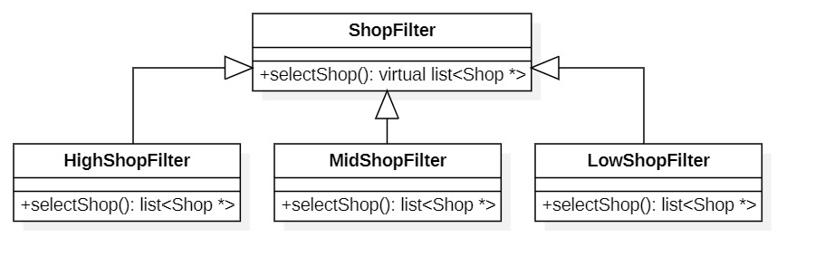
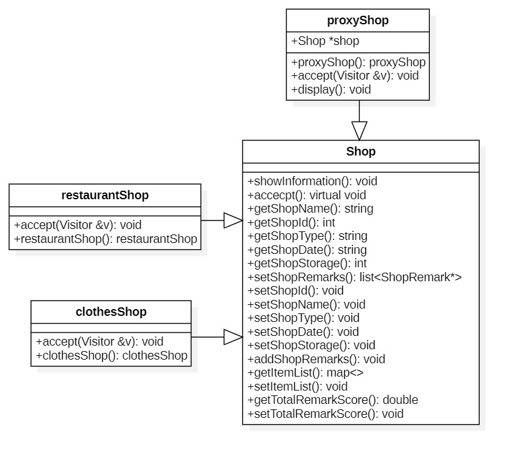
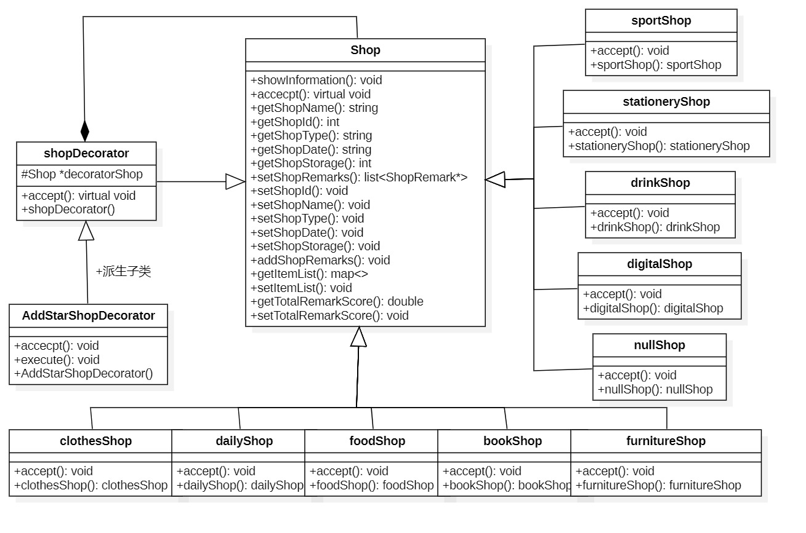
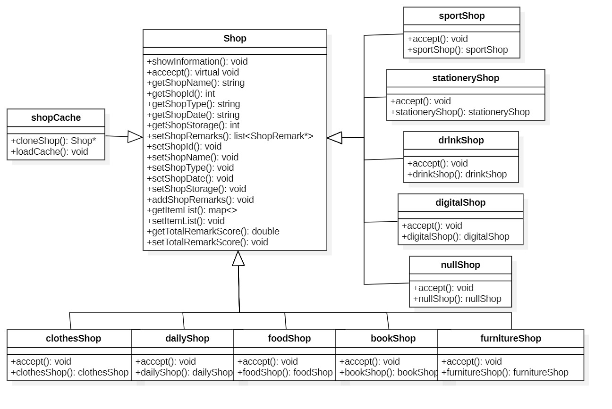

### 2.2 店铺子系统 Shop

#### 2.2.1 子系统的作用与功能
1. 浏览所有店铺概要信息
2. 对店铺进行评价
3. 根据评分筛选店铺
4. 查看店铺的详细信息
5. 查看所有店铺、指定店铺的商品列表

#### 2.2.2 设计模式详述
##### 抽象工厂模式 (Abstract Factory)
###### 模式应用场景
抽象工厂模式（Abstract Factory Pattern）是一种创建型设计模式，它提供了一种方式来创建一系列相关或依赖对象的家族，而无需指定具体的类。在抽象工厂模式中，抽象工厂作为所有工厂的基类，负责定义创建对象的接口，而具体的工厂则派生自抽象工厂，实现了创建具体对象的方法。

抽象工厂模式通过将具体的类实例化操作委托给工厂类，使得客户端代码与具体类解耦。客户端只需要与抽象工厂及其创建接口进行交互，而不需要直接调用具体的类。这样，当需要更换具体实现时，只需要更改具体工厂的实例，而不需要修改客户端代码。
###### 设计思路
在抽象工厂模式中，通常会定义一个抽象工厂接口，其中包含一组创建对象的虚函数。具体的工厂类会继承这个抽象工厂接口，并实现这些虚函数，以创建具体的对象。这样，客户端可以通过抽象工厂接口来使用具体的工厂，动态地获取所需的对象。

如下代码所示，定义抽象工厂类，用于创建店铺对象

```c++
class AbstractFactory {
public:
    virtual Shop *createShop(string type) = 0;
};
```
###### 代价说明

   - 增加代码复杂性。使用抽象工厂模式会引入更多的抽象类和接口，这可能增加代码的复杂性。需要定义抽象工厂、具体工厂和一组相关的抽象产品和具体产品类。这可能会增加项目的复杂性和理解成本。
   - 系统扩展困难。当需要向系统添加新的产品家族时，抽象工厂模式可能面临扩展困难。由于需要修改抽象工厂接口和所有具体工厂的实现，这可能导致修改大量的代码。
   - 增加约束性。使用抽象工厂模式可能会增加一定的约束性，限制了客户端的自由度和灵活性。客户端不能直接创建具体产品，而是通过抽象工厂接口创建产品。这可能使客户端失去对产品创建的控制权。
   - 关注点分离，客户端失去对产品创建的控制权。使用抽象工厂模式可能导致关注点分离困难。在使用抽象工厂模式时，客户端需要了解抽象工厂和抽象产品的接口，并与其进行交互。这可能导致客户端与具体产品的实现细节耦合，使得将来切换具体工厂或产品变得困难。

##### 工厂模式 (Factory) 
###### 模式应用场景
工厂模式（Factory Pattern）是一种创建型设计模式，用于根据特定的条件或参数创建对象。它通过将对象的创建逻辑封装在一个工厂类中，使得客户端代码与具体对象的实例化过程解耦。
###### 设计思路
在工厂模式中，通常会定义一个抽象工厂接口或基类，其中包含用于创建对象的方法。具体的工厂类会实现这个接口或继承这个基类，并根据不同的条件或参数来实例化对应的对象。

工厂模式的优点是可以隐藏实例化对象的具体过程，使得客户端代码更加简洁和可读。同时，它也提供了一种可扩展的方式，当需要添加新类型的店铺时，只需要新增对应的具体工厂类即可，而无需修改已有的代码。

在工厂模式中，工厂类负责创建对象，但并不一定需要通过继承的方式实现工厂类。可以根据具体的情况选择使用简单工厂、工厂方法或抽象工厂等不同的变体。

代码中的工厂只有一个函数，参数为店铺的类型，根据用户提供的类型来生产对应的店铺对象。这意味着你可以根据不同的店铺类型，通过调用工厂的函数来获取相应的店铺对象。
```c++
class ShopFactory : public AbstractFactory {
public:
    Shop *createShop(string type);
};
```
###### 代价说明
   - 增加代码复杂性，需要定义工厂接口和具体工厂类。工厂模式会引入更多的抽象类和接口，这可能增加代码的复杂性。需要定义工厂接口和具体工厂类，以及每个具体产品类。这样可能会增加项目的复杂性和理解成本。
      例如，我们正在开发一个店铺系统。使用工厂模式，我们需要定义工厂接口以及相关的具体工厂类（例如，文具店铺、饮料店铺等）。然后，我们需要为每种类型的具体产品（例如，文具、饮料等）实现具体的产品类。这将导致更多的类和接口，增加了代码的复杂性。
   - 增加类的数量，每个具体产品都需要对应一个具体工厂类。例如，继续上述店铺系统的例子，每种类型的具体产品都需要一个具体工厂类来实例化它。这可能会导致类的数量增加，使得代码变得更加臃肿。
   - 扩展时可能需要修改工厂接口和具体工厂类。当需要向系统添加新产品时，工厂模式可能面临扩展困难。由于需要修改工厂接口和所有具体工厂的实现，这可能导致修改大量的代码。
##### 空项目模式(Null Object) 
###### 模式应用场景
空项目模式（Null Object Mode）是一种软件设计模式，它的主要思想是在程序中使用一个“空对象”来替代空值。在软件开发过程中，程序往往需要对参数进行处理，但用户有时会忘记输入参数或者输入了空值或null值，这可能导致程序出现异常或无法正常运行。
###### 设计思路
通过使用空对象模式，程序可以在处理空值时不会出现异常或错误，并且可以保持程序的健壮性和功能完整性。当程序检测到参数为空或null时，可以创建一个空对象并将其作为参数传递给函数，空对象中的值都是没有意义的值，但程序可以按照生成对象的标准化来处理。

使用空对象模式的好处在于，它可以减少代码中的if-else语句，使代码更加简洁和易于维护。同时，它还可以让程序更加灵活，因为空对象可以模拟任何其他对象，从而使程序更容易扩展和修改。

定义了一个名为nullShop的类，并继承自Shop类
```c++
// nullShop与构造函数
class nullShop : public Shop {
public:

    void accept(Visitor &v);

    nullShop(const string &shopName, int shopId, const string &shopType, const string &shopDate, int shopStorage,
             double shopScore, const list<ShopRemark *> &shopRemarks, const map<CommodityInformation *, int> &itemList);
};
```
###### 代价说明
空项目模式虽然有助于项目的快速起步，但也有一些代价。这包括增加初始开发成本、可能引入冗余的代码或不必要的依赖，以及需要额外的工作来移除或替换空项目中的默认实现。
   - 增加初始开发成本，需要创建一个空项目作为基础框架。使用空项目模式需要创建一个空的项目作为基础框架。这意味着在项目开始时需要投入额外的时间和资源来建立基本的项目结构、配置文件、目录结构等。这增加了项目的初始开发成本。
   - 可能引入冗余的代码或不必要的依赖。空项目模式通常会提供一些默认的实现或依赖项，以帮助项目快速启动。然而，这些默认实现或依赖项可能并不是每个项目都需要的，可能会引入一些冗余的代码或不必要的依赖。
   - 可能需要额外的工作来移除或替换空项目中的默认实现。空项目模式的默认实现可能不符合项目的具体需求，因此可能需要进行修改、删除或替换。这可能需要额外的工作量和时间来调整基础框架以适应项目的实际需求。
##### 模板方法(Template Method)
###### 模式应用场景
模板方法模式（Template Method Pattern）是一种行为型设计模式，用于定义一个算法的骨架，将算法中的某些步骤延迟到子类中实现。它通过将不变的部分封装在父类中，将可变的部分留给子类来实现，从而实现代码的复用和扩展。
###### 设计思路
通过使用模板方法模式，可以将不变的部分（例如输出店铺信息的逻辑）放在基类中，而将可变的部分（例如不同类型店铺的详细信息）放在子类中实现。这样一来，可以实现代码的复用和扩展，同时提高了代码的可读性和可维护性。

在模板方法模式中，基类中定义了算法的骨架，但其中的某些步骤是延迟到子类中实现的。这些延迟实现的步骤通常是用抽象方法或虚方法来表示，以便子类进行具体的实现。

代码中有一个基类 Shop，派生出多个子类，每个子类根据用户输入的信息来派生。每个子类都包含三个函数：

1. showShopInformation(): 用于输出店铺的详细信息。这个函数在基类中被定义，并在子类中进行具体的实现。由于每个子类的店铺类型不同，因此在具体实现中可以输出对应类型的信息。

2. accept(): 与访问者模式（Visitor Pattern）共同使用，用于执行参数为 Visitor 类型时其中的调用函数。访问者模式是一种行为型设计模式，用于将算法与数据结构分离，使得可以在不修改数据结构的情况下增加新的操作。通过将 Visitor 对象传递给 accept() 函数，可以在不修改 Shop 类的情况下，执行特定的访问者操作。

3. 构造函数：用于生成对应的派生子类。每个子类都需要实现自己的构造函数，以便根据用户输入的信息来生成对应的店铺对象。

```c++
//以下为其中之一的子类及其构造函数
// restaurant Shop子类与构造函数
class restaurantShop : public Shop {
public:
    void accept(Visitor &v);

    restaurantShop(const string &shopName, int shopId, const string &shopType, const string &shopDate, int shopStorage,
             double shopScore, const list<ShopRemark *> &shopRemarks, const map<CommodityInformation *, int> &itemList);
};
```
###### 代价说明
   - 增加代码复杂性，需要使用抽象类或接口定义模板方法和子步骤。
   - 子类必须按照模板方法定义的算法结构进行实现，缺乏灵活性。模板方法要求子类按照父类定义的算法结构进行实现，这限制了子类的灵活性。子类无法自由地改变算法的结构，只能通过实现具体的步骤来定制某些部分。
   - 可能导致继承层次的深度增加，影响代码的维护和理解。使用模板方法可能导致继承层次的深度增加，尤其是当有多个相关的模板方法需要定义时。这增加了代码的复杂性，使得代码的维护和理解变得更加困难。但是在本项目中没有更深层次的继承，所以该点代价对本项目影响较小。
##### 类图


##### 详述

模板方法：`accept()`函数被声明为虚函数，根据基类所派生的子类的不同情况和访问者模式所派生的不同子类，决定具体该怎么执行。

抽象工厂模式：`AbstractFactory`为各个Factory的生产工厂，即由该抽象工厂先生产对应的工厂，后续再由各工厂生产其所对应的产品。其中生产`Shop`的工厂的`shopFactory`的函数`createShop()`对应声明为虚函数，以供工厂后续实际使用时重新定义和具体实现。

工厂模式：实例化一个`shopFactory`工厂，调用工厂中的`createShop()`函数，该函数会根据用户所提供的类型`type`返回一个店铺。

空对象模式：紧接上文，如果用户所提供的类型为`null`的话，一般的处理方法是输出一条错误信息然后返回空指针或空对象。但空对象模式支持用户未输入参数或输入参数为`null`类型的情况下仍然正确生成对象，符合OCP原则的同时增强了程序的工作能力和健壮性。

##### 实现接口与核心代码

```c++
Shop *ShopFactory::createShop(string type) {
    if (type == "")
        return new nullShop("unknown", rand() % 10000 + 10, "unknown", "2023-12-28", 0, 0, list<ShopRemark *>(),
                            map<CommodityInformation *, int>());

    else if (type == "restaurant")
        return new restaurantShop("newrestaurantshop", rand() % 10000 + 10, "restaurant", "2023-12-28", 0, 0, list<ShopRemark *>(),
                            map<CommodityInformation *, int>());

    else if (type == "drinks")
        return new drinksShop("newdrinksshop", rand() % 10000 + 10, "drinks", "2023-12-28", 0, 0, list<ShopRemark *>(),
                             map<CommodityInformation *, int>());

    else if (type == "digital")
        return new digitalShop("newDigitalshop", rand() % 10000 + 10, "digital", "2023-12-28", 0, 0,
                               list<ShopRemark *>(),
                               map<CommodityInformation *, int>());

    else if (type == "books")
        return new booksShop("newbooksshop", rand() % 10000 + 10, "books", "2023-12-28", 0, 0, list<ShopRemark *>(),
                            map<CommodityInformation *, int>());

    else if (type == "grocery")
        return new groceryShop("newgroceryshop", rand() % 10000 + 10, "grocery", "2023-12-28", 0, 0, list<ShopRemark *>(),
                             map<CommodityInformation *, int>());

    else if (type == "furniture")
        return new furnitureShop("newFurnitureshop", rand() % 10000 + 10, "furniture", "2023-12-28", 0, 0,
                                 list<ShopRemark *>(),
                                 map<CommodityInformation *, int>());

    else if (type == "clothes")
        return new clothesShop("newClothesshop", rand() % 10000 + 10, "clothes", "2023-12-28", 0, 0,
                               list<ShopRemark *>(),
                               map<CommodityInformation *, int>());

    else if (type == "stationery")
        return new stationeryShop("newStationeryshop", rand() % 10000 + 10, "stationery", "2023-12-28", 0, 0,
                                  list<ShopRemark *>(),
                                  map<CommodityInformation *, int>());

    else if (type == "sports")
        return new sportsShop("newsportsshop", rand() % 10000 + 10, "sports", "2023-12-28", 0, 0, list<ShopRemark *>(),
                             map<CommodityInformation *, int>());

    else if (type == "proxy")
        return new proxyShop("unknown", rand() % 10000 + 10, "unknown", "2023-12-28", 0, 0, list<ShopRemark *>(),
                             map<CommodityInformation *, int>(), nullptr);

    //非上述情况时，制造不出有意义的值，所以停止制造即可。
    return nullptr;
}
```


##### 访问者模式(Visitor Pattern)

###### 模式应用场景

访问者模式能够在不改变对象结构的前提下，对对象中的元素进行新的操作。该模式的核心思想是，定义一个访问者对象，并将其传递给需要被访问的对象，在对象接受访问者的访问时，会调用访问者对象中的方法，在该方法中实现对象对于访问者的响应操作。在本子系统中，通过访问者模式实现对店铺信息的访问。

###### UML类图


###### 设计思路

+ `Visitor`作为基类，承担了抽象访问者（Visitor）的角色，声明了纯虚函数`visit()`用来定义访问`Shop`类的操作。

+ `infoVisitor`作为派生类，承担了具体访问者（ConcreteVisitor）的角色，实现`visitor`类中定义的操作，展示店铺的详细信息。

+ `filterVisitor`作为派生类，承担了具体访问者（ConcreteVisitor）的角色，实现`visitor`类中定义的操作，展示利使用过滤器模式筛选之后店铺的详细信息。
+ `shop`类承担了抽象元素（Element）的角色，声明了纯虚函数`accept()`用来定义接受访问的操作。
+ `restaurantShop`、`clothesShop`等子类承担了具体元素（ConcreteElement）的角色，具体实现`accept()`操作。

###### 核心代码

在`shop.h`中定义了抽象访问者`Visitor`，具体访问者`infoVisitor`和`filterVisitor`。`Visitor`类中声明了纯虚函数`visit()`，`infoVisitor`类中对`visit()`的具体现实是调用`shop`类的`showShopInformation()`来展示店铺信息，`filterVisitor`类中对`visit()`的具体现实是调用`shop`类的`getShopId()`和`getShopName()`来展示过滤后的店铺信息。

```c++
//抽象访问者
class Visitor {
public:
    virtual void visit(Shop *shop) = 0;
};

//具体访问者，展示店铺信息
class infoVisitor : public Visitor {
public:
    void visit(Shop *shop) {
        shop->showShopInformation();
    }
};

//具体访问者，展示过滤后的店铺信息
class filterVisitor : public Visitor {
public:
    void visit(Shop *shop) {
        cout << shop->getShopId() << " - 店铺名称: " << shop->getShopName() << endl;
    }
};
```

###### 代价说明

+ 增加新元素困难。根据开闭原则，软件实体（类、模块、函数等）应该对扩展开放，而对修改关闭。也就是说，当需求发生变化时，应该通过增加新的代码来扩展现有功能，而不是直接修改现有代码。在访问者模式中，每增加一个新的元素类，都要在具体访问者类中增加相应的具体操作，这违背了开闭原则。
+ 改变元素类代价较高。访问者模式不适用于元素类经常变化的情况，因为若元素类发生了改变，访问者的接口和访问者的实现都要发生相应的改变，这会增加修改的工作量和维护的成本。
+ 破坏封装。为了让访问者能够访问元素的内部状态，元素类需要将自身的信息暴露给访问者，包括属性和方法。这破坏了对象的封装性，使得元素类的内部细节对外可见。


##### 过滤器模式(Filter Pattern)

###### 模式应用场景

过滤器模式是使用不同的标准来过滤一组对象，通过运算逻辑以解耦的方式将它们连接起来。简单来说，就是按条件筛选一组对象出来。在本子系统中，通过过滤器模式实现根据店铺评分过滤店铺。

###### UML类图



###### 设计思路

+ `ShopFilter`作为基类，承担了抽象过滤器（AbstractFilter）的角色，定义了根据店铺评分过滤店铺的方法，符合对应标准的店铺会被过滤到相应的过滤器中。
+ `HighShopFilter`、`MidShopFilter`、`LowShopFilter`作为派生类，承担了具体过滤器（ConcreteFilter）的角色，负责具体筛选规则的逻辑实现，最后再返回一个过滤后的列表。
+ `Shop`类是被过滤的主体角色（Subject）。按照一定的筛选标准，根据店铺评分的高低将店铺分别过滤到高分过滤器、中分过滤器、低分过滤器中。

###### 核心代码

在`shopFilter.h`中定义了抽象过滤器`ShopFilter`，三个具体过滤器`HighShopFilter`、`MidShopFilter`和`LowShopFilter`。

```c++
//抽象过滤器
class ShopFilter {
public:
    virtual list<Shop *> selectShop(list<Shop *> ShopList) = 0;
};

//三个具体过滤器
class HighShopFilter:public ShopFilter{
public:
    list<Shop *> selectShop(list<Shop *> ShopList);
};

class MidShopFilter:public ShopFilter{
public:
    list<Shop *> selectShop(list<Shop *> ShopList);
};

class LowShopFilter:public ShopFilter{
public:
    list<Shop *> selectShop(list<Shop *> ShopList);
};
```

`shopFilter.cpp`中是对三个具体过滤器类的`selectShop()`函数的实现。具体筛选规则为：若score>=7.5, 将之加入高分过滤器的列表中；若5<=score<7.5，将之加入中分过滤器的列表中；若2.5<=score<5，将之加入低分过滤器的列表中。

```c++
list<Shop *> HighShopFilter::selectShop(list<Shop *> ShopList) {
    list<Shop *> HighShopList;
    for (auto shop:ShopList) {
        if (shop->getTotalRemarkScore() >= 7.50)
            HighShopList.push_back(shop);
    }
    return HighShopList;
}

list<Shop *> MidShopFilter::selectShop(list<Shop *> ShopList) {
    list<Shop *> MidShopList;
    for (auto shop:ShopList) {
        if (shop->getTotalRemarkScore() >= 5.00 && shop->getTotalRemarkScore() < 7.50)
            MidShopList.push_back(shop);
    }
    return MidShopList;
}

list<Shop *> LowShopFilter::selectShop(list<Shop *> ShopList) {
    list<Shop *> LowShopList;
    for (auto shop:ShopList) {
        if (shop->getTotalRemarkScore() >= 2.50 && shop->getTotalRemarkScore() < 5.00)
            LowShopList.push_back(shop);
    }
    return LowShopList;
}
```

###### 代价说明

+ 性能问题。由于每次过滤都需要遍历整个数据集合，这会降低程序的运行效率，因此当数据集合非常大时，过滤器模式可能会导致性能问题。

+ 组合复杂性高。当需要组合多个过滤器时，可能需要编写大量的配置代码，这可能会增加代码的复杂性，并且导致代码的可维护性降低。

+ 灵活性受限。过滤器模式在设计时通常只考虑了特定的过滤条件和操作，这可能导致其在处理复杂查询逻辑或动态数据时的灵活性受限。如果需要支持更复杂的查询需求，可能需要编写大量的配置代码或修改过滤器的实现，从而增加了代码的复杂性和维护成本。

  

##### 代理模式(Proxy Pattern)

###### 模式应用场景

代理模式通过创建一个代理对象来控制对原始对象的访问，这样，当我们不方便或者不能直接访问真实对象时，可以通过代理对象来间接访问。在本子系统中，通过代理模式实现对`Shop`类的间接访问。

###### UML类图



###### 设计思路

+ 代理模式中，代理对象的声明中要包含被代理对象，这样，对代理对象的操作就可以转接到对被代理对象的操作，而非直接对被代理对象进行操作。
+ `proxyShop`类是代理对象，它是`Shop`的一个子类，但是其中包含了一个`Shop`类型的对象，这正是代理模式的核心所在。通过对`proxyShop`类进行操作来实现对`Shop`类的操作。

###### 核心代码

在`shop.h`中定义了代理对象`proxyShop`，`proxyShop`类中包含了一个`Shop`类型的对象，还定义了对应访问者模式的`accept()`函数和展示店铺信息的`display()`函数。

```c++
//代理对象
class proxyShop:public Shop{
private:
    Shop *shop;
public:
    proxyShop(const string &shopName, int shopId, const string &shopType, 
              const string &shopDate, int shopStorage, double shopScore, 
              const list<ShopRemark *> &shopRemarks, 
              const map<CommodityInformation *, int> &itemList,
              Shop *shop);
    
    void accept(Visitor &v);

    //展示店铺信息
    void display();
};
```

在`shop.cpp`中完成了`proxyShop`类的`display()`函数的具体实现：若shop指针为空，则创建一个表示未知店铺的对象，调用`shop`类的`showShopInformation()`来展示店铺信息。

```c++
void proxyShop::display() {
    if (shop == nullptr) {
        shop = new nullShop("unknown", rand() % 10000 + 10, "unknown", "2023-12-28", 
                            0, 0, list<ShopRemark *>(),
                            map<CommodityInformation *, int>());
    }
    shop->showShopInformation();
}
```

###### 代价说明

+ 复杂性增高。代理模式在原有的对象之外引入了代理对象，这会导致代码的间接性和复杂性增高，逻辑变得更加复杂，增加了程序设计和维护的难度。
+ 性能损耗。由于请求需要通过代理对象转发给实际对象，需要额外的计算和网络通信开销，因此会造成一定程度上的调用延迟。特别是在处理大量数据或频繁调用的情况下，代理模式可能会对系统的性能产生一定的影响，造成一定的性能损耗。


##### 装饰器模式

###### 模式应用场景

当需要在不改变已有对象功能的情况下，动态地增加或修改对象的行为时，可以使用装饰器模式。装饰器模式可以使得功能的扩展对于使用者来说是透明的，不需要了解具体细节。例如，对商店进行打分，以分数装饰店铺可以使得商铺具有不同行为。

###### UML类图



###### 设计思路

+ 装饰器模式创建了一个装饰类，用来包装原有的类。它可以在不改变原有类的结构的情况下，动态地为其添加新的行为和功能，类似于套娃一样将功能层层包装，在运行时添加新的行为而又不改变原有的结构。这种类型的设计模式属于结构型模式，它是作为现有的类的一个包装。

+ 以店铺评分为例，`shopDecorator`是一个装饰器基类，它添加了一些额外的行为或者状态来改变原有店铺的行为，比如我们可以在其基础上派生出一个子类——`AddStarShopDecorator`装饰器，用以给某个特定店铺进行评分。这个装饰器覆盖了`shopDecorator`原有的execute()函数，使得原有店铺的行为被包装为一个装饰器实例，并附带了我们新增的行为。

###### 核心代码

节选自`shop.h`与`shop.cpp`

```c++
class shopDecorator : public Shop {
protected:
    Shop *decoratedShop;
public:
    virtual void accept(Visitor &v);

    shopDecorator(const string &shopName, int shopId, const string &shopType, const string &shopDate, int shopStorage,
                  double shopScore, const list<ShopRemark *> &shopRemarks,
                  const map<CommodityInformation *, int> &itemList, Shop *decoratedShop);
};
```

定义一个基类 shopDecorator 属于抽象装饰器类，是所有装饰器的基类，它实现了与 Shop 相同的接口，这样我们可以使用装饰器对象替代原始对象，并且可以以相同的方式与它们进行交互。

```c++
class AddStarShopDecorator : public shopDecorator {
public:

    void accept(Visitor &v);

    void execute() {
        decoratedShop->setRemarkScore(10.00);
    }

    AddStarShopDecorator(const string &shopName, int shopId, const string &shopType, const string &shopDate,
                         int shopStorage, double shopScore, const list<ShopRemark *> &shopRemarks,
                         const map<CommodityInformation *, int> &itemList, Shop *decoratedShop);
};
```

定义一个派生类 AddStarShopDecorator，来实现在不改变原来类 Shop 功能的情况下，动态地为 Shop 类增加新的功能。在 AddStarShopDecorator 类中，我们持有一个指向 Shop 对象的引用，即 decoratedShop。通过这个引用，AddStarShopDecorator 可以调用 Shop 对象中的方法，并且可以对其结果进行修改或添加额外的行为。在 execute 方法中，AddStarShopDecorator 实现了具体的装饰逻辑。

```c++
shopDecorator::shopDecorator(const string &shopName, int shopId, const string &shopType, const string &shopDate,
                             int shopStorage, double shopScore, const list<ShopRemark *> &shopRemarks,
                             const map<CommodityInformation *, int> &itemList, Shop *decoratedShop) 
                               :Shop(shopName,shopId,shopType,shopDate,
                                    shopStorage,shopScore,shopRemarks,
                                    itemList),
                                decoratedShop(decoratedShop) {}

void shopDecorator::accept(Visitor &v) {
    return v.visit(this);
}
```

accept 方法实现了 Visitor 模式，用于处理 Decorator 的访问，即在 Visitor 中通过 visit 函数，将 Decorator 对象传递给 Visitor 进行处理。

```c++
AddStarShopDecorator::AddStarShopDecorator(const string &shopName, int shopId, const string &shopType,
                                           const string &shopDate, int shopStorage, double shopScore,
                                           const list<ShopRemark *> &shopRemarks,
                                           const map<CommodityInformation *, int> &itemList, Shop *decoratedShop)
                                           : shopDecorator(shopName, shopId, shopType, shopDate, 
                                                           shopStorage, shopScore, shopRemarks, itemList,
                                                           decoratedShop) {}

void AddStarShopDecorator::accept(Visitor &v) {
    setRemarkScore(10.00);
    //return v.visit(this);
}

```
###### 代价说明

+ 使用装饰器模式会增加类的数量，从而增加系统的复杂度，这会使代码维护变得更加困难。因此，在应用装饰器模式时，需要仔细权衡增加灵活性和增加复杂度之间的代价。
+ 装饰器模式要求装饰器类必须与原始类实现同样的接口或继承关系。这就要求在设计原始类时，要充分考虑后续可能需要添加的装饰器，并在接口或基类的设计上留有扩展的余地。

##### 原型模式 Prototype

###### 模式应用场景

在某些情况下，对象的创建过程可能非常复杂或耗时较长。使用原型模式可以通过复制已有对象的方式来快速创建新对象，避免重复的创建过程，降低对象的创建成本，也能避免频繁的创建和销毁对象。

###### UML类图



###### 设计思路

+ 原型模式提供了一种创建对象的最佳方式。通过复制或克隆现有对象来创建新对象，减少了创建对象的代价。这属于对象创建模式，可以在不直接实例化对象的情况下创建新对象，同时又保证了系统性能。

+ 该模式核心是一个原型接口——定义了克隆方法，用于创建当前对象的克隆。当直接创建对象的代价较高时，可以使用原型模式来提高性能和效率。例如，在访问高代价的数据库操作之后创建对象，可以将已有的对象缓存起来，在下一个请求时返回它的克隆，避免重复的数据库调用。

+ 初始化商店使用原型模式。商店对象是将预先创建好的商店加入原型类中的数据缓存库，当需要创建新商店时，可以通过ID查找该数据缓存库，如果找到了对应的商店对象，则直接利用克隆方法完成快速拷贝，避免了重复创建和初始化商店对象的代价。


###### 核心代码

节选自`shopInterface.h`与`shopInterface.cpp`

```c++
class shopCache{
private:
    map<Shop*,int> _shopMap; //  原型模式所需的商店数据缓存库
public:
    Shop* cloneShop(int shopID);//  根据ID获取数据缓存库中的店铺以便复制
    void loadCache();// 预先设置缓存的函数
};
```

定义一个实现商店缓存的类 shopCache。_shopMap 是一个 Shop* 类型到 int 类型的映射，用于存储商店对象和对应的 ID。cloneShop(int shopID) 是一个函数，用于根据给定的商店ID从数据缓存库中获取店铺对象，并将其克隆（复制）出来。返回一个指向克隆店铺的指针。loadCache() 是一个预先设置缓存的函数。它可能会在一开始执行，用于初始化 _shopMap 和缓存相应的商店对象。具体的实现取决于代码中的具体逻辑，该部分在提供的代码中没有给出。你可以在 loadCache() 函数中加载商店对象到 _shopMap 中。

```c++
/*
 * 设计模式：原型模式 Prototype
 * 因为商店接近初始化、高静态、低动态，不需要大规模、频繁的变化，使得原型模式发挥以完成商店模态的浅拷贝
 * 先在商店数据缓存库中加入所有的已有商店，然后在实际初始化的时候直接使用已有的商店。
 * 确保已有的商店都是可以找到的，找不到返回空指针nullptr。
 */
void shopCache::loadCache() {
        ShopRemark *defaultRemark = new ShopRemark("2021-01-01", "Administrator", "Good.", 5);
    list<ShopRemark *> defaultRemarkList;

    defaultRemarkList.push_back(defaultRemark);

    map<CommodityInformation *, int> defaultGoodsList;

    Shop *shop0 = new nullShop("同济空商店", 0, "", "", 0, 0, defaultRemarkList, defaultGoodsList);
    _shopMap[shop0] = 0;

    Shop *shop1 = new restaurantShop("同济餐饮熟食店", 1, "restaurant", "2003-09-29", 0, 0, defaultRemarkList, defaultGoodsList);
    _shopMap[shop1] = 1;
    
    Shop *shop2 = new drinksShop("同济小汁饮品店", 2, "drinks", "2013-09-18", 0, 0, defaultRemarkList, defaultGoodsList);
    _shopMap[shop2] = 2;

    Shop *shop3 = new digitalShop("同济软件电子专营店", 3, "digital", "2008-09-20", 0, 0, defaultRemarkList, defaultGoodsList);
    _shopMap[shop3] = 3;

    Shop *shop4 = new booksShop("同济图书专卖店", 4, "books", "2021-11-10", 0, 0, defaultRemarkList, defaultGoodsList);
    _shopMap[shop4] = 4;

    Shop *shop5 = new groceryShop("同济鲜德宝日用品店", 5, "grocery", "2023-12-15", 0, 0, defaultRemarkList, defaultGoodsList);
    _shopMap[shop5] = 5;

    Shop *shop6 = new furnitureShop("嘉实家具购置店", 6, "furniture", "2013-09-30", 0, 0, defaultRemarkList, defaultGoodsList);
    _shopMap[shop6] = 6;

    Shop *shop7 = new clothesShop("同济冬天不怕冷服装店", 7, "clothes", "2004-12-01", 0, 0, defaultRemarkList, defaultGoodsList);
    _shopMap[shop7] = 7;

    Shop *shop8 = new stationeryShop("同济学子文具店", 8, "stationery", "2016-04-28", 0, 0, defaultRemarkList,
                                     defaultGoodsList);
    _shopMap[shop8] = 8;

    Shop *shop9 = new sportsShop("同济体育（嘉定体育馆分店）", 9, "sports", "2020-12-26", 0, 0, defaultRemarkList, defaultGoodsList);
    _shopMap[shop9] = 9;

    Shop *shop10 = new AddStarShopDecorator("同济装饰器控分空商店", 10, "", "", 0, 10, defaultRemarkList, defaultGoodsList,
                                            new nullShop("", 0, "", "", 0, 0, defaultRemarkList, defaultGoodsList));
    _shopMap[shop10] = 10;
}
```
在商店缓存库中，使用原型模式创建了多个不同类型的商店实例，并将它们存储在一个商店映射表中。这些商店实例用于在实际初始化商店时进行浅拷贝，确保可以找到已有的商店，并返回指向这些商店的指针。

```c++
// 寻找商店进行复制，用于原型模式
Shop *shopCache::cloneShop(int shopID) {
    for (auto _map:_shopMap) {
        if (_map.second == shopID)
            return _map.first;
    }
    return nullptr;
}
```
函数cloneShop接受一个商店ID作为参数，然后在商店映射表_shopMap中进行查找。遍历_shopMap，对于每个映射项，检查其对应的商店ID是否与传入的商店ID相等。如果存在匹配的商店ID，就返回对应的商店实例指针，并完成复制操作。如果遍历完整个_shopMap都没有找到与传入的商店ID匹配的商店实例，那么函数返回nullptr。

###### 代价说明

+ 在原型模式克隆对象时需要进行浅拷贝，这可能会导致一定的性能损耗，特别是在对象的结构较为复杂时。商店对象的复制使用的是浅拷贝，所以需要谨慎处理对象中的引用类型。
+ 原型模式通过复制已有对象来创建新对象，这使得代码中存在大量的重复代码，增加了代码量和调试复杂性。