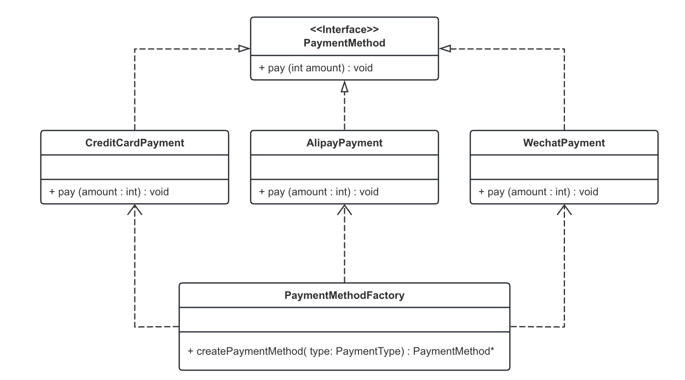
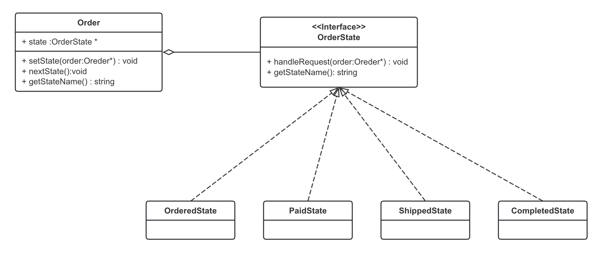
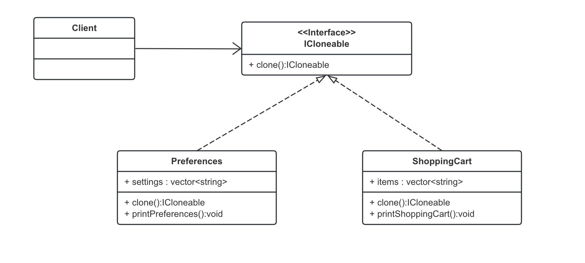
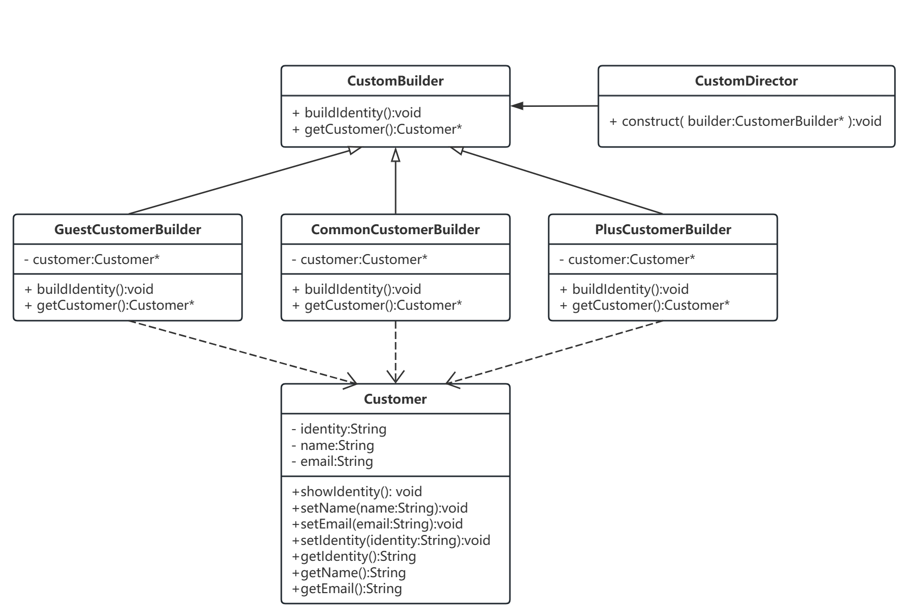
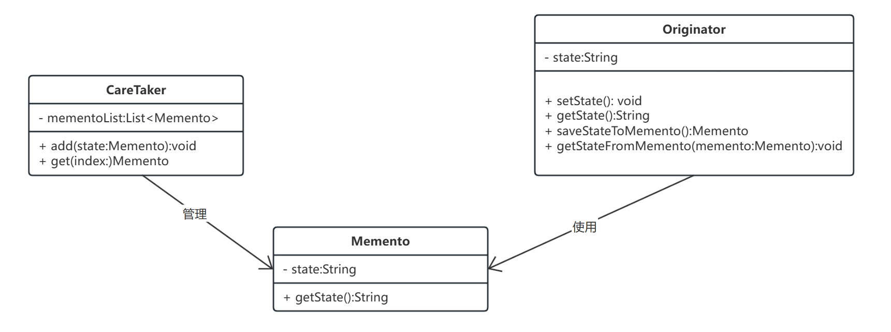
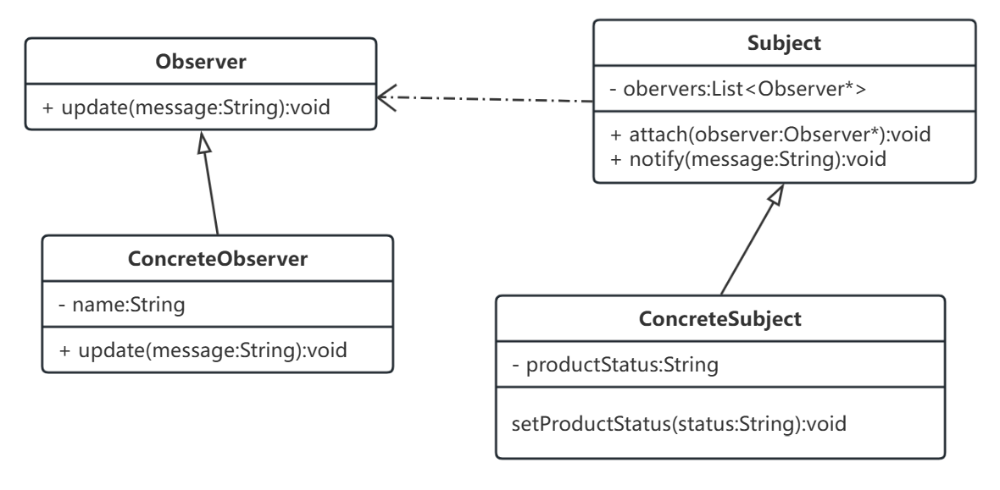

# 软件设计模式期末项目文档

## 课程情况
2023 Fall 史扬 周三下午 9-11 节
## 组员
 张唯琛 2151414
 孟雨昕 2151421
 胡芮宁 2153068

## 项目概要

本项目由6个子系统组成，每个子系统由3个模块组成
1. 子系统功能概述
2. 子系统总 UML 类图
3. 设计模式
    1. A 设计模式
        1. 模式应用场景【说明这个模式在本子系统中实现怎样的作用】
        2. 该设计模式的 UML 类图
        3. 说明各个类的作用以及设计思路【格式不限】
        4. 贴代码
        5. 代价说明（使用此设计模式的负面代价）
   1. B 设计模式

## 全局命令子系统-lrk

### 功能概述

### UML 类图

### 设计模式
#### 模块模式
##### 模式应用场景
##### 模式UML类图
##### 模式设计思路
##### 核心代码
##### 代价说明

## 顾客子系统

### 功能概述

本系统包含了有关用户信息的一系列操作，定义了订单、支付、个人信息等领域的功能和设计模式。主要包含的设计模式如下所示：

* 工厂模式：支付模块
* 状态模式：订单模块
* 原型模式：信息模块
* 建造者模式：用户身份构建模块
* 外观模式：个人信息编辑模块
* 备忘录模式：备份回滚功能
* 观察者模式：商品促销通知模块

### UML 类图

### 设计模式

#### 工厂模式

##### 模式应用场景

工厂方法（Factory Method）是一种创建型设计模式，它提供了一种创建对象的方式，但允许子类决定要实例化的类。这种模式是通过定义一个创建对象的接口，但让实现这个接口的类来决定实例化哪个类来实现的，从而将对象创建的过程委托给子类

在电商平台的上下文中，我们可以使用工厂方法来创建不同类型的支付方式。例如，我们可能有多种支付方式，如信用卡支付、支付宝支付、微信支付等，每种支付方式都有自己的处理逻辑。

##### 模式UML类图



##### 模式设计思路

> **PaymentMethodFactory**

该类是工厂模式类，主要用于创建不同的实例化对象，从而使用不同的支付逻辑。这样设计的好处在于可以达到不同支付方法的低耦合，从而便于管理特定支付方式的业务逻辑。

> **PaymentMethod**

该类是支付方式的抽象基类，定义了支付类的支付方法。不同的支付方式进行实例化，重构对应的支付逻辑。

> **CreditCardPayment**

该类具体实现了信用卡支付方式的业务逻辑。

> **AlipayPayment**

该类具体实现了支付宝支付方式的业务逻辑。

> **WechatPayment**

该类具体实现了微信支付方式的业务逻辑。

##### 核心代码

```c++
// PaymentMethod.h
#ifndef PAYMENT_METHOD_H
#define PAYMENT_METHOD_H

#include <iostream>
#include <stdexcept>

// 抽象基类
class PaymentMethod {
public:
    virtual void pay(int amount) = 0; // 纯虚函数
    virtual ~PaymentMethod() {} // 虚析构函数
};

// CreditCardPayment 类声明
class CreditCardPayment : public PaymentMethod {
public:
    void pay(int amount) override;
};

// AlipayPayment 类声明
class AlipayPayment : public PaymentMethod {
public:
    void pay(int amount) override;
};

// WechatPayment 类声明
class WechatPayment : public PaymentMethod {
public:
    void pay(int amount) override;
};

// PaymentMethodFactory 类声明
class PaymentMethodFactory {
public:
    enum PaymentType {
        CREDIT_CARD,
        ALIPAY,
        WXPAY
    };

    static PaymentMethod* createPaymentMethod(PaymentType type);
};

#endif // PAYMENT_METHOD_H

```


##### 代价说明

在电商平台中使用工厂方法（Factory Method）模式来创建不同类型的支付方式（如信用卡支付、电子钱包支付）确实可以提供一定程度的灵活性和封装性，但同时也会带来一些潜在的负面代价，这些包括：

1. **增加代码复杂性**：
   - 实现工厂方法模式通常需要引入额外的类和接口，这可能增加系统的整体复杂度。对于简单的支付方式创建需求，这种额外的复杂性可能是不必要的。
2. **扩展性问题**：
   - 虽然工厂方法模式提供了一定的灵活性，但在添加新的支付方式时，仍然需要修改工厂类，添加新的工厂方法或修改现有的逻辑，这可能违反了开闭原则（对扩展开放，对修改封闭）。
3. **理解和维护成本提升**：
   - 对于新加入项目的开发人员来说，理解工厂模式的工作原理和各个支付方式类之间的关系可能需要一定时间，增加了学习和维护的成本。
4. **过度设计风险**：
   - 如果支付方式不是经常变化或者变化不大，使用工厂方法可能会导致过度设计。在这种情况下，更简单的实现方法可能更为合适。
5. **测试复杂性增加**：
   - 测试工厂方法模式涉及的类可能比直接实例化具体类更为复杂，因为需要验证工厂是否能够正确地创建各种类型的支付方式对象。
6. **性能开销**：
   - 虽然通常不显著，但工厂方法模式可能会引入一些运行时的性能开销，尤其是在频繁创建和销毁支付对象的场景中。
7. **间接性导致的调试难度**：
   - 工厂方法模式的间接性可能在某些情况下使得调试更加困难，特别是当涉及到多层工厂和复杂的创建逻辑时。

#### 状态模式

##### 模式应用场景

在电商平台中，状态（State）模式的应用主要集中在订单处理的不同阶段。订单在其生命周期内会经历多个状态，每个状态代表订单的不同阶段。状态模式允许订单对象在这些不同的状态间平滑转换，同时保持状态特定行为的封装。这种模式提高了代码的可维护性和扩展性，使得新增或修改订单状态变得更加简单。

##### 模式UML类图



##### 模式设计思路

> **OrderState**

该类是订单状态抽象基类，其中定义了订单进行状态变更和状态获取的方法。

> **Order**

该类是订单信息的抽象基类，其中定义了一个实际订单中如何进行订单转换和订单状态获取，使用状态模式来管理其在不同阶段的行为。

> **OrderedState**

该类具体定义了处于已下单状态的订单的管理和转换方法。

> **PaidState**

该类具体定义了处于已支付状态的订单的管理和转换方法。

> **ShippedState**

该类具体定义了处于已发货状态的订单的管理和转换方法。

>**CompletedState**

该类具体定义了处于已完成状态的订单的管理和转换方法。

##### 核心代码

```c++
// OrderState.h订单状态类
#ifndef ORDER_STATE_H  // 头文件保护开始
#define ORDER_STATE_H

#include<iostream>
using namespace std;

class Order;

class OrderState {
public:
    virtual ~OrderState() {}

    // 状态管理
    virtual void handleRequest(Order *order) = 0;

    // 获取当前状态的名称
    virtual string getStateName() const = 0;
};

#endif // ORDER_STATE_H  // 头文件保护结束


// Order.h订单类
#include "OrderState.h"

// Order 类，表示一个订单
class Order {
private:
    OrderState *state; // 当前状态

public:
    Order() : state(nullptr) {}
    ~Order() { delete state; }

    // 设置订单的当前状态
    void setState(OrderState *state) {
        delete this->state;
        this->state = state;
    }

    // 转移到下一个状态
    void nextState() {
        if (state) {
            state->handleRequest(this);
        }
    }

    // 获取当前状态的名称
    std::string getStateName() const {
        return state ? state->getStateName() : "No State";
    }
    
};
```

##### 代价说明

在考虑使用状态模式时，重要的是要仔细评估这些潜在的负面影响，并根据具体的应用场景和需求做出决策。在一些情况下，可能需要寻找更简单或更适合的设计模式来处理订单的状态管理。

1. **增加了类的数量**：
   - 状态模式需要为每种可能的状态创建一个新的类。这可能导致类的数量迅速增加，尤其是在状态较多的复杂系统中。
2. **维护成本提高**：
   - 随着状态数量的增加，维护这些状态类的工作也会变得更加繁重。每个状态类都需要维护和更新，尤其是当业务逻辑发生变化时。
3. **复杂性增加**：
   - 对于新加入项目的开发人员来说，理解所有状态及其之间的转换可能比较困难。状态模式可能会引入一定程度的学习曲线。
4. **状态转换逻辑的复杂性**：
   - 在一些复杂的业务场景中，状态之间的转换逻辑可能非常复杂，需要仔细处理状态转换的条件和时机。
5. **测试难度提升**：
   - 测试包含多个状态和状态转换的系统可能更加困难，因为需要覆盖所有可能的状态和转换路径。
6. **过度设计的风险**：
   - 对于某些简单的场景，使用状态模式可能是过度设计。如果系统的状态管理相对简单，使用状态模式可能会引入不必要的复杂性。
7. **依赖性问题**：
   - 状态类可能会依赖于订单类的内部实现，这可能导致紧耦合，使得系统的某些部分难以独立变更或重用

#### 原型模式

##### 模式应用场景

原型（Prototype）模式在软件开发中通常用于创建对象的副本。在您提到的应用场景中——快速复制或克隆用户的偏好设置和购物车内容——原型模式可以有效地实现对象的复制功能，同时避免了直接使用构造函数创建新实例时可能涉及的复杂性和资源消耗。

##### 模式UML类图



##### 模式设计思路

> **ICloneable**

该类是原型接口类，用于定义克隆方法，其他具体实例可以实现对应的接口，来实现资源复制的功能。

> **Preferences**

该类定义了用户偏好设置，实现了原型接口的具体业务逻辑

> **ShoppingCart**

该类定义了购物车内容，实现了原型接口的具体业务逻辑

##### 核心代码

```c++
// ICloneable.h
#ifndef ICLONEABLE_H
#define ICLONEABLE_H

// 原型接口类
class ICloneable {
public:
    virtual ~ICloneable() {}

    // 纯虚函数，用于克隆对象
    virtual ICloneable* clone() const = 0;
};

#endif // ICLONEABLE_H

// Preferences.h
#ifndef PREFERENCES_H
#define PREFERENCES_H

#include "ICloneable.h"
#include <vector>
#include <string>
#include<iostream>
using namespace std;

// 用户偏好设置类
class Preferences : public ICloneable {
private:
    vector<string> settings; // 存储用户偏好设置

public:
    Preferences();
    Preferences(const vector<string>& settings);

    // 实现 ICloneable 接口的克隆方法
    ICloneable* clone() const override;

    // 打印偏好设置的方法
    void printPreferences() const;
};

#endif // PREFERENCES_H

// ShoppingCart.h
#ifndef SHOPPINGCART_H
#define SHOPPINGCART_H

#include "ICloneable.h"
#include <vector>
#include <string>
#include<iostream>
using namespace std;

// 购物车类
class ShoppingCart : public ICloneable {
private:
    vector<string> items; // 存储购物车中的商品

public:
    ShoppingCart();
    ShoppingCart(const vector<string>& items);

    // 实现 ICloneable 接口的克隆方法
    ICloneable* clone() const override;

    // 打印购物车内容的方法
    void printShoppingCart() const;
};

#endif // SHOPPINGCART_H

```


##### 代价说明

针对场景——在电商平台的顾客子系统中使用原型模式来快速复制或克隆用户的偏好设置和购物车内容，以下是更具体的负面代价分析：

1. **数据一致性问题**：
   - 当用户的偏好设置或购物车内容被克隆后，如果原始数据发生变化（比如价格更新、库存变动），克隆出的副本不会同步更新，可能导致用户看到的信息过时或错误。

2. **深拷贝的复杂性**：
   - 用户偏好设置和购物车可能包含多层嵌套的对象（如商品详情、折扣信息等）。实现这些对象的深拷贝可能既复杂又耗时，特别是当它们包含循环引用或共享资源时。

3. **性能开销**：
   - 如果购物车或偏好设置包含大量数据，克隆操作可能会消耗显著的计算资源和时间，尤其是在高流量的电商平台上。

4. **隐私和安全性考虑**：
   - 克隆包含个人信息的偏好设置和购物车内容时，需要小心处理以防泄露用户数据。不当的克隆实现可能导致敏感信息的未授权访问。

5. **维护和更新挑战**：
   - 如果电商平台的数据结构或业务逻辑发生变化，可能需要相应地更新克隆逻辑。这可能增加代码的维护难度和成本。

6. **过度使用原型模式的风险**：
   - 在某些情况下，直接创建新实例而非克隆可能更简单、更直观。过度使用原型模式可能导致不必要的复杂性，尤其是在不需要频繁创建相似对象的场景中。

7. **错误处理的复杂性**：
   - 克隆过程中可能发生的错误（如内存分配失败）需要被妥善处理，否则可能导致程序异常或崩溃。

#### 建造者模式

##### 模式应用场景

在一个电商平台系统中，使用建造者模式可以灵活地创建和管理不同类型的用户，如游客、普通用户和 PLUS 用户。每种类型的用户可能有不同的特征和行为。例如，PLUS 用户可能有额外的优惠和服务。由于用户对象的创建可能涉及多个步骤，例如设置身份、姓名、邮箱等。系统需要灵活地创建不同配置的用户对象，而不是使用单一、固定的构造方法。

##### 模式UML类图



##### 模式设计思路

- **抽象建造者（`CustomerBuilder`）**：定义创建用户对象的接口，声明一系列构建用户对象所需的步骤。
- **具体建造者（`GuestCustomerBuilder`、`CommonCustomerBuilder`、`PlusCustomerBuilder`）**：实现抽象建造者的接口，提供创建特定类型用户的具体逻辑。
- **指挥者（`CustomerDirector`）**：负责安排已有模块的顺序，然后告诉建造者开始构建。
- **产品（`Customer`）**：最终构建的对象，包含多个部分如身份、姓名、邮箱等。

##### 核心代码

```c++
// CustomerBuilder.h
#ifndef CUSTOMER_BUILDER_M
#define CUSTOMER_BUILDER_M


#include<string>
#include<iostream>
using namespace std;
class Customer {
public:
    string identity;  // 用户身份：游客、普通用户、PLUS用户
    string name;      // 用户姓名
    string email;     // 用户邮箱

    void showIdentity() {
        cout << "用户身份: " << identity << endl;
    }
    void setName(const string& name) { this->name = name; }
    void setEmail(const string& email) { this->email = email; }
    string getName() const { return name; }
    string getEmail() const { return email; }
    


};

class CustomerBuilder {
public:
    virtual void buildIdentity() = 0;
    virtual Customer* getCustomer() = 0;
    virtual ~CustomerBuilder() {}
};

class GuestCustomerBuilder : public CustomerBuilder {
private:
    Customer* customer;

public:
    GuestCustomerBuilder() {
        customer = new Customer();
    }

    void buildIdentity() override {
        customer->identity = "游客";
    }

    Customer* getCustomer() override {
        return customer;
    }
};


class CommonCustomerBuilder : public CustomerBuilder {
private:
    Customer* customer;

public:
    CommonCustomerBuilder() {
        customer = new Customer();
    }

    void buildIdentity() override {
        customer->identity = "普通用户";
    }

    Customer* getCustomer() override {
        return customer;
    }
};

class PlusCustomerBuilder : public CustomerBuilder {
private:
    Customer* customer;

public:
    PlusCustomerBuilder() {
        customer = new Customer();
    }

    void buildIdentity() override {
        customer->identity = "尊贵的PLUS用户";
    }

    Customer* getCustomer() override {
        return customer;
    }
};

class CustomerDirector {
public:
    static void construct(CustomerBuilder* builder) {
        builder->buildIdentity();
    }
};

#endif // CUSTOMER_BUILDER_M
```

##### 代价说明

##### 优点

1. **用户类型的灵活扩展**：
   您的系统可能需要处理不同类型的用户（游客、普通用户、PLUS用户），每种类型可能具有不同的特征和行为。建造者模式允许您轻松添加新的用户类型或修改现有类型的属性和行为，而无需修改现有类或创建大量条件语句。

2. **创建过程的封装和复用**：
   对于创建用户的过程，建造者模式封装了复杂的逻辑，使得客户端代码（如 UI 逻辑）可以不涉及复杂的创建细节。这不仅减少了代码重复，还简化了客户端代码。

3. **改善代码的可维护性和可读性**：
   您的系统可能会随着时间的推移而演变，需要添加新的用户属性或修改用户的行为。建造者模式通过将这些构建步骤封装在单独的类中，使得维护和更新变得更加容易。

##### 缺点

1. **增加代码复杂性**：
   对于简单的用户创建需求，采用建造者模式可能会使系统变得不必要地复杂。如果用户对象的创建非常直接且不涉及多个可变部分，那么建造者模式可能是一种过度设计。

2. **额外的学习曲线**：
   对于新团队成员来说，理解建造者模式及其在您的系统中的应用可能需要更多时间。这种模式引入了多个额外的类和接口，需要花费时间来理解它们是如何协同工作的。

3. **潜在的性能考虑**：
   在用户创建过程中，建造者模式可能涉及更多对象的创建和销毁，这在性能敏感的场景下可能需要考虑。特别是在高流量的电商平台上，性能优化可能是一个关键考虑因素。

4. **维护成本**：
   如果电商平台的用户类型频繁变化，维护多个建造者类可能会增加工作量。每次变动都可能需要更新相应的建造者实现，这可能导致维护成本的上升。

总结来说，建造者模式在电商平台系统中主要提供了灵活性和可扩展性，特别适用于用户类型多样且用户创建过程复杂的情况。但同时，它也可能带来更高的初始实现复杂性和维护成本。

#### 外观模式

##### 模式应用场景

在电商平台系统中，外观模式（Facade Pattern）可以用来提供一个简化的接口来处理复杂的子系统，这里用来管理个人信息，例如管理更新个人资料、查看个人信息等。外观模式可以提供一个统一的接口来处理这些操作，隐藏背后复杂的逻辑。这样可以提高代码的可读性和易用性，同时降低客户端与子系统间的直接依赖。

##### 模式UML类图


##### 模式设计思路

- **定义一个外观类**（如 `CustomerAccountFacade`）：
  - 这个类封装了对一个或多个复杂子系统（如用户信息系统、订单处理系统）的访问，提供客户端一个简单的接口。
- **简化客户端与子系统的交互**：
  - 客户端代码（如网页前端或移动应用）通过外观类与系统交互，而不是直接与复杂的子系统打交道，这降低了客户端代码的复杂性和子系统之间的依赖性。
- **封装子系统的复杂性**：
  - 外观类隐藏了其背后子系统的复杂性，使得客户端代码更简洁、更清晰。

##### 核心代码

```c++
// CustomerFacade.h
#ifndef CUSTOMER_FACADE_M
#define CUSTOMER_FACADE_M


#include<iostream>
#include<string>
#include"CustomerBuilder.h"
#include"Memento.h"
class CustomerAccountFacade {
private:
    Customer* customer;
    CareTaker careTaker;
    Originator originator;

public:
    explicit CustomerAccountFacade(Customer* customer) : customer(customer) {}

    // 提供简单的接口来处理用户账户信息
     void backupAccountInfo() {
        originator.setState(customer->getName() + ";" + customer->getEmail()); // 将状态设为name;email
        careTaker.add(originator.saveStateToMemento());
    }

    void rollbackAccountInfo(int index) {
        originator.getStateFromMemento(careTaker.get(index));
        auto state = originator.getState();
        auto delimiterPos = state.find(';');
        customer->setName(state.substr(0, delimiterPos));
        customer->setEmail(state.substr(delimiterPos + 1));
    }
    void showAccountInfo() {
        cout<<endl<<"显示个人信息："<<endl;
        cout << "姓名: " << customer->getName() << endl;
        cout << "邮箱: " << customer->getEmail() << endl;
        customer->showIdentity();
        cout<<endl;
    }

    void updateAccountInfo() {
        string name,email;
        cout<<endl<<"编辑个人信息,如跳过请输入skip"<<endl;
        cout<<"请输入用户姓名:";
        cin>>name;
        if(name!="skip")
            customer->setName(name);
        cout<<"请输入用户邮箱:";
        cin>>email;
        if(email!="skip")
            customer->setEmail(email);
        if(name=="skip"&&email=="skip")
            cout<<"退出编辑，个人信息未修改~"<<endl;
        cout<<"退出编辑，已成功保存个人信息！"<<endl<<endl;
        backupAccountInfo();
    }
};

#endif // CUSTOMER_FACADE_M
```

##### 代价说明

- **优点**：
  - **提高了可用性**：外观模式使客户端代码更易于使用和理解，尤其是在处理复杂子系统时。
  - **降低了耦合度**：减少了客户端和子系统之间的直接交互，降低了耦合度，使得系统更易于维护和扩展。
  - **简化了代码**：对于客户端开发者来说，不需要了解底层的复杂逻辑，只需与外观类交互。
- **缺点**：
  - **可能成为单点故障**：如果外观类的实现有问题，可能会影响到所有使用它的客户端。
  - **有限的功能**：外观可能无法提供子系统的所有功能，特别是一些更高级或特定的功能。在这种情况下，客户端可能需要直接与子系统交互。
  - **可能导致子系统难以独立演进**：如果过多依赖于外观提供的功能，子系统的更改可能会影响外观的行为，反过来也会如此。

在电商平台系统中，使用外观模式可以有效地简化复杂操作的处理，如用户账户管理，同时提供清晰、简洁的接口给客户端。这有助于改善整体的代码结构和降低系统复杂性，但也需要注意避免过度依赖单一外观类，以及确保外观类的稳定性和可维护性。

#### 备忘录模式

##### 模式应用场景

在电商平台中，用户可能需要修改个人信息，如邮箱等个性化信息。备忘录模式允许在更改之前保存当前状态，以便在需要时可以恢复，可及时回滚之前的状态。

##### 模式UML类图



##### 模式设计思路

- **`Memento` 类**：
  - 用于存储对象的内部状态。在电商平台中，它可以保存用户的个人信息状态或订单状态。
- **`Originator` 类**：
  - 这是状态需要被保存和恢复的对象。它创建包含当前状态的 `Memento` 对象，并可以使用 `Memento` 对象恢复到以前的状态。
- **`CareTaker` 类**：
  - 负责保存 `Memento` 对象。它知道何时捕获对象的状态以及何时恢复状态，但不知道 `Memento` 的实现细节。

##### 核心代码

```c++
// Memento.h
#ifndef CUSTOMER_MOMENTO_M
#define CUSTOMER_MOMENTO_M


#include<iostream>
#include<string>
#include<vector>
using namespace std;
class Memento {
private:
    string state;

public:
    Memento(const string& state) : state(state) {}
    string getState() const { return state; }
};

class Originator {
private:
    string state;

public:
    void setState(const string& state) {
        this->state = state;
    }

    string getState() const {
        return state;
    }

    Memento saveStateToMemento() {
        return Memento(state);
    }

    void getStateFromMemento(const Memento& memento) {
        state = memento.getState();
    }
};

class CareTaker {
private:
    vector<Memento> mementoList;

public:
    void add(const Memento& state) {
        mementoList.push_back(state);
    }

    Memento get(int index) {
        return mementoList.at(index);
    }
};

#endif // CUSTOMER_MOMENTO_M
```

##### 代价说明

- **优点**：
  - **封装性**：备忘录模式很好地封装了状态的保存和恢复，使得原始对象的内部状态对其他对象是不可见的，从而保护了对象的封装性。
  - **简化原始对象**：原始对象（`Originator`）不需要管理状态的保存和恢复，其职责更加清晰。
  - **提供回滚操作**：在复杂操作中提供了一种安全的回滚机制。
- **缺点**：
  - **资源消耗**：如果需要保存的状态数据很大，那么随着备忘录对象数量的增加，将消耗大量内存。
  - **复杂性**：实现和维护备忘录模式可能会增加系统的复杂性。
  - **潜在的性能问题**：如果频繁地进行状态保存，尤其是在大量数据涉及的情况下，可能会对性能造成影响。

在电商平台中，备忘录模式提供了一种优雅的方式来管理用户的状态变化，例如在编辑个人资料或管理订单时，它使得用户能够自由地尝试更改，而又不必担心无法撤销错误操作。然而，实现和维护该模式需要谨慎考虑资源使用和系统复杂性。

#### 观察者模式

##### 模式应用场景

在电商平台系统中，观察者模式可以用于实现事件通知和状态更新机制，特别是在涉及多个依赖于某个状态或信息的对象时。当产品状态发生变化（如新的促销活动、库存更新等）时，系统需要通知所有关注该产品的用户。观察者模式允许用户作为观察者订阅这些更新。

##### 模式UML类图



##### 模式设计思路

- **`Observer` 接口**：
  - 定义了一个 `Observer` 接口，它包含一个 `update` 方法。这允许具体的观察者对象在状态发生变化时得到通知。
- **`ConcreteObserver` 类**：
  - 这是 `Observer` 接口的具体实现。在您的代码中，`ConcreteObserver` 通过打印一条消息来响应更新。它存储用户姓名，这可能是为了在通知时个性化显示。
- **`Subject` 类**：
  - 这是观察对象的抽象类，它维护了一个观察者列表，并提供了 `attach` 方法来添加观察者。
- **`ConcreteSubject` 类**：
  - 这是 `Subject` 类的具体实现。``ConcreteSubject` 负责设置产品状态并在状态改变时通知所有注册的观察者。

##### 核心代码

```c++
// Observer.h
#ifndef CUSTOMER_OBSERVER_M
#define CUSTOMER_OBSERVER_M


#include<iostream>
#include<string>
#include<vector>
using namespace std;
class Observer {
public:
    virtual void update(const string& message) = 0;
    virtual ~Observer() {}
};

class ConcreteObserver : public Observer {
private:
    string name; // 存储用户姓名

public:
    explicit ConcreteObserver(const string& name) : name(name) {}

    void update(const string& message) override {
        cout << "[" << name << "] " << message << endl;
    }
};


class Subject {
private:
    vector<Observer*> observers;

public:
    void attach(Observer* observer) {
        observers.push_back(observer);
    }

    void notify(const string& message) {
        for (auto* observer : observers) {
            cout<<endl<<"[系统通知]:"<<message<<endl;
            observer->update(message);
            cout<<endl;
        }
    }
};

class ConcreteSubject : public Subject {
private:
    string productStatus;

public:
    void setProductStatus(const string& status) {
        productStatus = status;
        notify(productStatus); // 当产品状态改变时，通知所有观察者
    }
};

#endif // CUSTOMER_MOMENTO_M
```

##### 代价说明

- **优点**：
  - **解耦**：观察者模式提高了商品或店铺和观察者之间的解耦。主题只需知道观察者列表，并不需要了解观察者的具体实现。
  - **动态订阅/取消订阅**：观察者可以随时开始或停止接收更新，这在动态系统中非常有用。
  - **实时通知**：一旦状态发生变化，所有订阅的观察者都会立即收到通知。
- **缺点**：
  - **潜在的过度更新**：如果主题频繁地更改状态，可能导致观察者频繁收到更新，从而影响性能。
  - **内存泄漏风险**：如果观察者没有正确地取消订阅，可能导致内存泄漏。
  - **更新顺序问题**：在某些情况下，通知观察者的顺序可能会影响系统的行为或一致性。

在电商平台中，观察者模式可以作为一种有效的机制来处理用户通知和实时数据更新。它为用户提供了及时获得重要信息的途径，同时也使系统各部分能够保持良好的解耦。然而，需要注意管理观察者的生命周期和更新的效率，以避免潜在的性能问题。

## 店铺子系统

## 商品子系统

## 活动与广告子系统

## 订单子系统
