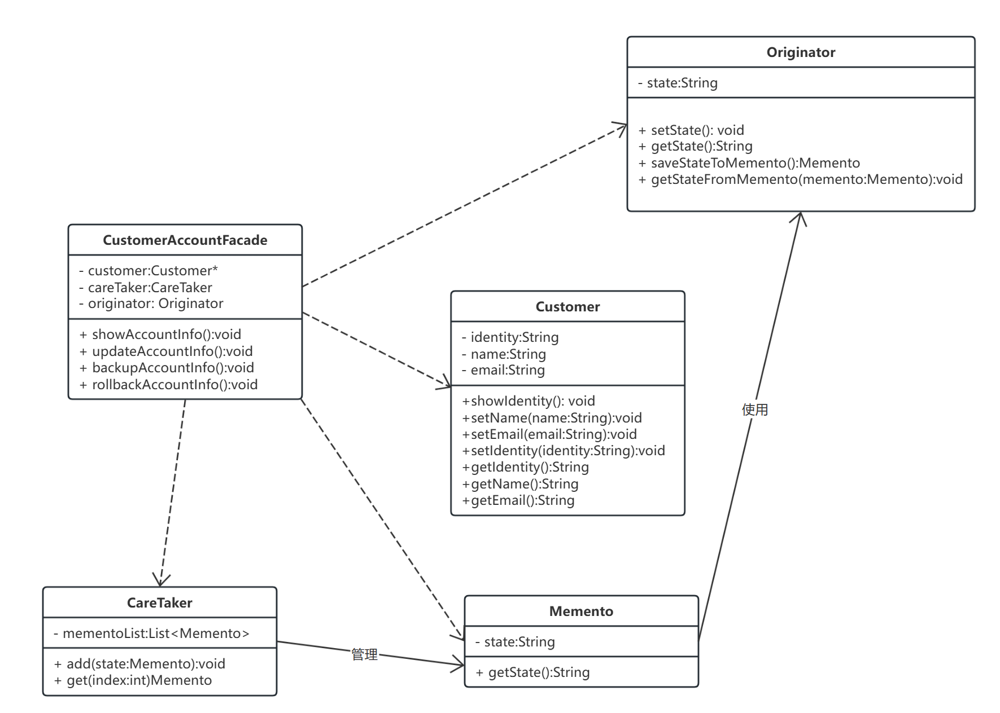

[TOC]

# 期末项目文档

## 课程情况
2023 Fall 史扬 周三下午 9-11 节

张唯琛 2151414 整体设计分析与答辩

田宇潇 2152618 广告与活动子系统设计 

余宙 2152043 订单子系统设计、PPT

徐焯文 2153275 商品子系统设计

孟雨昕 2151421 客户子系统设计 

胡芮宁 2153068 客户子系统设计 

刘潇 2153069 店铺子系统

孙韩雅 2151133 店铺子系统

袁皓玥  2151780 店铺子系统

黎睿康 2152837 全局命令子系统 

## 项目概要

本项目由6个子系统组成，每个子系统由3个模块组成
1. 子系统功能概述
2. 子系统总 UML 类图
3. 设计模式
    1. A 设计模式
        1. 模式应用场景【说明这个模式在本子系统中实现怎样的作用】
        2. 该设计模式的 UML 类图
        3. 说明各个类的作用以及设计思路【格式不限】
        4. 贴代码
        5. 代价说明（使用此设计模式的负面代价）
   1. B 设计模式

## 全局命令子系统-lrk

### 功能概述

​	本系统主要负责调用各个子系统。在用户进入系统时，通过键盘和用户进行交互，用户通过键盘输入数字选择对应的子系统访问系统。主要包含的设计模式如下所示：

- 模块模式：将全局使用的类和函数等打包
- 适配器模式：用户命令

### 设计模式

#### 模块模式

##### 模式应用场景

模块模式（Module Pattern）被用来封装全局所需的成员，例如类、变量和函数等。在这个例子中，模块模式被用来将用户在交互界面中可用的命令提示封装成模块，这些模块组合成一个全局的用户命令提示系统，并在主函数中进行调用。`showCmds`是一个全局的命令提示类，其中的各个派生子类代表针对不同子系统的命令，每个函数用于输出对应的命令提示。

这样做的目的和好处有二：1、可以减少重复的代码量，加强代码的整洁度和可读性。2、打包所有要用到的零碎命令，加强输出信息的结构性和系统性。3、对于有面向对象背景的开发者来讲，模块模式相对于真正的封装概念更清晰。4、模块模式支持私有数据，因此，在模块模式中，公共部分代码可以访问私有数据，但是在模块外部，不能访问类的私有部分。

##### 模式UML类图


##### 模式设计思路

在复杂的系统中，需要有界面为用户提供交互，以便用户更好访问系统。该系统的设计核心在于建立良好的用户交互模块、子系统调用管理和系统集成。通过清晰的接口定义和良好的调度机制，可以使用户能够方便地选择并访问各个子系统，同时系统也需要具备稳健的错误处理机制和用户友好的反馈，以提供良好的用户体验。最后，通过测试和优化，不断改进系统性能和稳定性。

在该系统中的***Cmds类继承了showCMds，模块集成了各个系统的打印类，不同类调用相同类型的函数，能够更好、更集中地完成打印。

##### 核心代码

~~~c++
/* 设计模式 模块模式 Module Pattern
 * 模块模式一般用于集成、打包全局要使用的相关的类、方法、函数
 * 这个类集成了全局中主程序与用户交互时给用户输出的信息。
 * showCmds为基类，其中有一个函数showUserCmds()以及适配器等
 *      该函数在具体派生类中会根据具体情况向用户输出不同的交互信息。
 *      目前有用户命令、店铺命令、商品命令、购物车命令、订单命令等。
 * 上述函数只负责输出命令提示，用户可以根据上述提示在主函数进行多种操作
 */
……
// 展示主界面命令
void showUserInterfaceCmds::showUserCmds() {
    cout << endl;
    cout << "欢迎光临天猫双十一购物节！请选择操作！" << endl;
    cout << "1 - 用户信息" << endl;
    cout << "2 - 店铺" << endl;
    cout << "3 - 商品" << endl;
    cout << "4 - 活动与广告" << endl;
    cout << "5 - 购物车" << endl;
    cout << "6 - 查看订单列表" << endl;
    cout << "0 - 退出" << endl;
}

//展示订单命令
void showUserOrderCmds::showUserCmds() {
    cout << endl;
    cout << "您正在查看您的订单信息！" << endl;
    cout << "1 - 查看您进行中的订单" << endl;
    cout << "2 - 支付全部未支付的订单" << endl;
    cout << "3 - 查看所有订单" << endl;
    cout << "0 - 退出" << endl;
}

//初始化适配器
void showUserCmdsAdapter::displayExistingCommands() {
    vector<string> _AdapterCommands = {"用户命令", "店铺命令", "商品命令", "购物车命令", "订单命令"};
    concreteCommands.setConcreteCommands(_AdapterCommands);
    cout << "已有的用户可以使用的命令提示集合: " << endl;
    for (string _commands:concreteCommands.getConcreteCommands()) {
        cout << _commands << endl;
    }
}

//作为参数，依赖注入并初始化外部接口类
void Initial() {
    shopInterface shopInterface;
    shopInterface.initialize();
}
~~~

##### 代价说明

模块模式的缺点包括以下几点：首先，它使用了不同的访问方式来处理公有和私有成员，因此，要改变这些成员的可见性时，需要在所有使用这些成员的地方进行代码修改。其次，无法在对象之后添加的方法中访问私有变量，这导致在紧急修复 bug 时引入额外的复杂性，无法对私有成员进行直接修复。最后，由于无法为私有成员创建自动化的单元测试，开发人员不能简单地扩展私有成员，需要谨记私有成员并非具有表面上看起来的可扩展性。

#### 适配器模式

##### 模式应用场景

适配器模式是使得原本由于接口不兼容而不能一起工作的那些类可以一起工作，衔接两个不兼容、独立的接口的功能，使得它们能够一起工作，适配器起到中介的作用。

在该系统中，几个接口类Cmds，是相互独立的接口功能类，使用`showUseCmdsAdapter` 将这些类连接在一起，方便系统统一调用。

##### 模式UML类图


##### 模式设计思路

要将几个Cmds类联系在一起，在设计中使用到了`vector<String>`的容器，使得能够存储各个类的调用信息，同时使用display函数能够展示具体的`concreteCommands`。通过适配器将一个外部类的功能融入到基类中，以增强基类的功能性。这种设计模式能够让不兼容的接口协同工作，提高了系统的扩展性和灵活性。

##### 核心代码

~~~c++
/*
 * 设计模式 - 适配器模式 Adapter Mode
 * 使用适配器模式可以在派生类中融入外部的其他对象和增加基类中没有的功能
 * 本适配器中，融入了外部一个包含所有命令集合的类，以及输出它们的新函数（基类没有）
 * 增强了类和对象的功能性。
 */
class showUserCmdsAdapter : public showCmds {
private:
    ConcreteCommands concreteCommands;
public:
    // 展示现存命令系统
    void displayExistingCommands();
};

//初始化适配器
void showUserCmdsAdapter::displayExistingCommands() {
    vector<string> _AdapterCommands = {"用户命令", "店铺命令", "商品命令", "购物车命令", "订单命令"};
    concreteCommands.setConcreteCommands(_AdapterCommands);
    cout << "已有的用户可以使用的命令提示集合: " << endl;
    for (string _commands:concreteCommands.getConcreteCommands()) {
        cout << _commands << endl;
    }
}
~~~

##### 代价说明

在系统设计方面，引入适配器类会增加系统的复杂性。适配器类需要额外的代码来实现适配逻辑，这增加了代码的数量和复杂度，可能会增加系统的理解和维护成本。同时如果系统中存在大量的适配器类，这可能意味着系统设计存在问题。过多使用适配器可能暗示着系统中的类和接口设计不够合理，需要重新考虑系统的整体架构。

在系统维护方面，如果接口经常发生变化，可能需要频繁修改适配器类。这样会增加代码的维护成本和风险。

在系统性能方面，适配器模式在转换接口的过程中会引入额外的开销，可能会影响系统的性能。尤其是在处理大量数据或高频率调用的情况下，需要仔细考虑适配器模式的性能影响。

## 顾客子系统

### 功能概述

本系统包含了有关用户信息的一系列操作，定义了订单、支付、个人信息等领域的功能和设计模式。主要包含的设计模式如下所示：

* 工厂模式：支付模块
* 状态模式：订单模块
* 原型模式：信息模块
* 建造者模式：用户身份构建模块
* 外观模式：个人信息编辑模块
* 备忘录模式：备份回滚功能
* 观察者模式：商品促销通知模块

### 设计模式

#### 工厂模式

##### 模式应用场景

工厂方法（Factory Method）是一种创建型设计模式，它提供了一种创建对象的方式，但允许子类决定要实例化的类。这种模式是通过定义一个创建对象的接口，但让实现这个接口的类来决定实例化哪个类来实现的，从而将对象创建的过程委托给子类

在电商平台的上下文中，我们可以使用工厂方法来创建不同类型的支付方式。例如，我们可能有多种支付方式，如信用卡支付、支付宝支付、微信支付等，每种支付方式都有自己的处理逻辑。

##### 模式UML类图


##### 模式设计思路

> **PaymentMethodFactory**

该类是工厂模式类，主要用于创建不同的实例化对象，从而使用不同的支付逻辑。这样设计的好处在于可以达到不同支付方法的低耦合，从而便于管理特定支付方式的业务逻辑。

> **PaymentMethod**

该类是支付方式的抽象基类，定义了支付类的支付方法。不同的支付方式进行实例化，重构对应的支付逻辑。

> **CreditCardPayment**

该类具体实现了信用卡支付方式的业务逻辑。

> **AlipayPayment**

该类具体实现了支付宝支付方式的业务逻辑。

> **WechatPayment**

该类具体实现了微信支付方式的业务逻辑。

##### 核心代码

```c++
// PaymentMethod.h
#ifndef PAYMENT_METHOD_H
#define PAYMENT_METHOD_H

#include <iostream>
#include <stdexcept>

// 抽象基类
class PaymentMethod {
public:
    virtual void pay(int amount) = 0; // 纯虚函数
    virtual ~PaymentMethod() {} // 虚析构函数
};

// CreditCardPayment 类声明
class CreditCardPayment : public PaymentMethod {
public:
    void pay(int amount) override;
};

// AlipayPayment 类声明
class AlipayPayment : public PaymentMethod {
public:
    void pay(int amount) override;
};

// WechatPayment 类声明
class WechatPayment : public PaymentMethod {
public:
    void pay(int amount) override;
};

// PaymentMethodFactory 类声明
class PaymentMethodFactory {
public:
    enum PaymentType {
        CREDIT_CARD,
        ALIPAY,
        WXPAY
    };

    static PaymentMethod* createPaymentMethod(PaymentType type);
};

#endif // PAYMENT_METHOD_H

```

##### 代价说明

在电商平台中使用工厂方法（Factory Method）模式来创建不同类型的支付方式（如信用卡支付、电子钱包支付）确实可以提供一定程度的灵活性和封装性，但同时也会带来一些潜在的负面代价，这些包括：

1. **增加代码复杂性**：
   - 实现工厂方法模式通常需要引入额外的类和接口，这可能增加系统的整体复杂度。对于简单的支付方式创建需求，这种额外的复杂性可能是不必要的。
2. **扩展性问题**：
   - 虽然工厂方法模式提供了一定的灵活性，但在添加新的支付方式时，仍然需要修改工厂类，添加新的工厂方法或修改现有的逻辑，这可能违反了开闭原则（对扩展开放，对修改封闭）。
3. **理解和维护成本提升**：
   - 对于新加入项目的开发人员来说，理解工厂模式的工作原理和各个支付方式类之间的关系可能需要一定时间，增加了学习和维护的成本。
4. **过度设计风险**：
   - 如果支付方式不是经常变化或者变化不大，使用工厂方法可能会导致过度设计。在这种情况下，更简单的实现方法可能更为合适。
5. **测试复杂性增加**：
   - 测试工厂方法模式涉及的类可能比直接实例化具体类更为复杂，因为需要验证工厂是否能够正确地创建各种类型的支付方式对象。
6. **性能开销**：
   - 虽然通常不显著，但工厂方法模式可能会引入一些运行时的性能开销，尤其是在频繁创建和销毁支付对象的场景中。
7. **间接性导致的调试难度**：
   - 工厂方法模式的间接性可能在某些情况下使得调试更加困难，特别是当涉及到多层工厂和复杂的创建逻辑时。

#### 状态模式

##### 模式应用场景

在电商平台中，状态（State）模式的应用主要集中在订单处理的不同阶段。订单在其生命周期内会经历多个状态，每个状态代表订单的不同阶段。状态模式允许订单对象在这些不同的状态间平滑转换，同时保持状态特定行为的封装。这种模式提高了代码的可维护性和扩展性，使得新增或修改订单状态变得更加简单。

##### 模式UML类图


##### 模式设计思路

> **OrderState**

该类是订单状态抽象基类，其中定义了订单进行状态变更和状态获取的方法。

> **Order**

该类是订单信息的抽象基类，其中定义了一个实际订单中如何进行订单转换和订单状态获取，使用状态模式来管理其在不同阶段的行为。

> **OrderedState**

该类具体定义了处于已下单状态的订单的管理和转换方法。

> **PaidState**

该类具体定义了处于已支付状态的订单的管理和转换方法。

> **ShippedState**

该类具体定义了处于已发货状态的订单的管理和转换方法。

>**CompletedState**

该类具体定义了处于已完成状态的订单的管理和转换方法。

##### 核心代码

```c++
// OrderState.h订单状态类
#ifndef ORDER_STATE_H  // 头文件保护开始
#define ORDER_STATE_H

#include<iostream>
using namespace std;

class Order;

class OrderState {
public:
    virtual ~OrderState() {}

    // 状态管理
    virtual void handleRequest(Order *order) = 0;

    // 获取当前状态的名称
    virtual string getStateName() const = 0;
};

#endif // ORDER_STATE_H  // 头文件保护结束


// Order.h订单类
#include "OrderState.h"

// Order 类，表示一个订单
class Order {
private:
    OrderState *state; // 当前状态

public:
    Order() : state(nullptr) {}
    ~Order() { delete state; }

    // 设置订单的当前状态
    void setState(OrderState *state) {
        delete this->state;
        this->state = state;
    }

    // 转移到下一个状态
    void nextState() {
        if (state) {
            state->handleRequest(this);
        }
    }

    // 获取当前状态的名称
    std::string getStateName() const {
        return state ? state->getStateName() : "No State";
    }
    
};
```

##### 代价说明

在考虑使用状态模式时，重要的是要仔细评估这些潜在的负面影响，并根据具体的应用场景和需求做出决策。在一些情况下，可能需要寻找更简单或更适合的设计模式来处理订单的状态管理。

1. **增加了类的数量**：
   - 状态模式需要为每种可能的状态创建一个新的类。这可能导致类的数量迅速增加，尤其是在状态较多的复杂系统中。
2. **维护成本提高**：
   - 随着状态数量的增加，维护这些状态类的工作也会变得更加繁重。每个状态类都需要维护和更新，尤其是当业务逻辑发生变化时。
3. **复杂性增加**：
   - 对于新加入项目的开发人员来说，理解所有状态及其之间的转换可能比较困难。状态模式可能会引入一定程度的学习曲线。
4. **状态转换逻辑的复杂性**：
   - 在一些复杂的业务场景中，状态之间的转换逻辑可能非常复杂，需要仔细处理状态转换的条件和时机。
5. **测试难度提升**：
   - 测试包含多个状态和状态转换的系统可能更加困难，因为需要覆盖所有可能的状态和转换路径。
6. **过度设计的风险**：
   - 对于某些简单的场景，使用状态模式可能是过度设计。如果系统的状态管理相对简单，使用状态模式可能会引入不必要的复杂性。
7. **依赖性问题**：
   - 状态类可能会依赖于订单类的内部实现，这可能导致紧耦合，使得系统的某些部分难以独立变更或重用

#### 原型模式

##### 模式应用场景

原型（Prototype）模式在软件开发中通常用于创建对象的副本。在您提到的应用场景中——快速复制或克隆用户的偏好设置和购物车内容——原型模式可以有效地实现对象的复制功能，同时避免了直接使用构造函数创建新实例时可能涉及的复杂性和资源消耗。

##### 模式UML类图


##### 模式设计思路

> **ICloneable**

该类是原型接口类，用于定义克隆方法，其他具体实例可以实现对应的接口，来实现资源复制的功能。

> **Preferences**

该类定义了用户偏好设置，实现了原型接口的具体业务逻辑

> **ShoppingCart**

该类定义了购物车内容，实现了原型接口的具体业务逻辑

##### 核心代码

```c++
// ICloneable.h
#ifndef ICLONEABLE_H
#define ICLONEABLE_H

// 原型接口类
class ICloneable {
public:
    virtual ~ICloneable() {}

    // 纯虚函数，用于克隆对象
    virtual ICloneable* clone() const = 0;
};

#endif // ICLONEABLE_H

// Preferences.h
#ifndef PREFERENCES_H
#define PREFERENCES_H

#include "ICloneable.h"
#include <vector>
#include <string>
#include<iostream>
using namespace std;

// 用户偏好设置类
class Preferences : public ICloneable {
private:
    vector<string> settings; // 存储用户偏好设置

public:
    Preferences();
    Preferences(const vector<string>& settings);

    // 实现 ICloneable 接口的克隆方法
    ICloneable* clone() const override;

    // 打印偏好设置的方法
    void printPreferences() const;
};

#endif // PREFERENCES_H

// ShoppingCart.h
#ifndef SHOPPINGCART_H
#define SHOPPINGCART_H

#include "ICloneable.h"
#include <vector>
#include <string>
#include<iostream>
using namespace std;

// 购物车类
class ShoppingCart : public ICloneable {
private:
    vector<string> items; // 存储购物车中的商品

public:
    ShoppingCart();
    ShoppingCart(const vector<string>& items);

    // 实现 ICloneable 接口的克隆方法
    ICloneable* clone() const override;

    // 打印购物车内容的方法
    void printShoppingCart() const;
};

#endif // SHOPPINGCART_H

```

##### 代价说明

针对场景——在电商平台的顾客子系统中使用原型模式来快速复制或克隆用户的偏好设置和购物车内容，以下是更具体的负面代价分析：

1. **数据一致性问题**：
   - 当用户的偏好设置或购物车内容被克隆后，如果原始数据发生变化（比如价格更新、库存变动），克隆出的副本不会同步更新，可能导致用户看到的信息过时或错误。

2. **深拷贝的复杂性**：
   - 用户偏好设置和购物车可能包含多层嵌套的对象（如商品详情、折扣信息等）。实现这些对象的深拷贝可能既复杂又耗时，特别是当它们包含循环引用或共享资源时。

3. **性能开销**：
   - 如果购物车或偏好设置包含大量数据，克隆操作可能会消耗显著的计算资源和时间，尤其是在高流量的电商平台上。

4. **隐私和安全性考虑**：
   - 克隆包含个人信息的偏好设置和购物车内容时，需要小心处理以防泄露用户数据。不当的克隆实现可能导致敏感信息的未授权访问。

5. **维护和更新挑战**：
   - 如果电商平台的数据结构或业务逻辑发生变化，可能需要相应地更新克隆逻辑。这可能增加代码的维护难度和成本。

6. **过度使用原型模式的风险**：
   - 在某些情况下，直接创建新实例而非克隆可能更简单、更直观。过度使用原型模式可能导致不必要的复杂性，尤其是在不需要频繁创建相似对象的场景中。

7. **错误处理的复杂性**：
   - 克隆过程中可能发生的错误（如内存分配失败）需要被妥善处理，否则可能导致程序异常或崩溃。

#### 建造者模式

##### 模式应用场景

在一个电商平台系统中，使用建造者模式可以灵活地创建和管理不同类型的用户，如游客、普通用户和 PLUS 用户。每种类型的用户可能有不同的特征和行为。例如，PLUS 用户可能有额外的优惠和服务。由于用户对象的创建可能涉及多个步骤，例如设置身份、姓名、邮箱等。系统需要灵活地创建不同配置的用户对象，而不是使用单一、固定的构造方法。

##### 模式UML类图


##### 模式设计思路

- **抽象建造者（`CustomerBuilder`）**：定义创建用户对象的接口，声明一系列构建用户对象所需的步骤。
- **具体建造者（`GuestCustomerBuilder`、`CommonCustomerBuilder`、`PlusCustomerBuilder`）**：实现抽象建造者的接口，提供创建特定类型用户的具体逻辑。
- **指挥者（`CustomerDirector`）**：负责安排已有模块的顺序，然后告诉建造者开始构建。
- **产品（`Customer`）**：最终构建的对象，包含多个部分如身份、姓名、邮箱等。

##### 核心代码

```c++
// CustomerBuilder.h
#ifndef CUSTOMER_BUILDER_M
#define CUSTOMER_BUILDER_M


#include<string>
#include<iostream>
using namespace std;
class Customer {
public:
    string identity;  // 用户身份：游客、普通用户、PLUS用户
    string name;      // 用户姓名
    string email;     // 用户邮箱

    void showIdentity() {
        cout << "用户身份: " << identity << endl;
    }
    void setName(const string& name) { this->name = name; }
    void setEmail(const string& email) { this->email = email; }
    string getName() const { return name; }
    string getEmail() const { return email; }
    


};

class CustomerBuilder {
public:
    virtual void buildIdentity() = 0;
    virtual Customer* getCustomer() = 0;
    virtual ~CustomerBuilder() {}
};

class GuestCustomerBuilder : public CustomerBuilder {
private:
    Customer* customer;

public:
    GuestCustomerBuilder() {
        customer = new Customer();
    }

    void buildIdentity() override {
        customer->identity = "游客";
    }

    Customer* getCustomer() override {
        return customer;
    }
};


class CommonCustomerBuilder : public CustomerBuilder {
private:
    Customer* customer;

public:
    CommonCustomerBuilder() {
        customer = new Customer();
    }

    void buildIdentity() override {
        customer->identity = "普通用户";
    }

    Customer* getCustomer() override {
        return customer;
    }
};

class PlusCustomerBuilder : public CustomerBuilder {
private:
    Customer* customer;

public:
    PlusCustomerBuilder() {
        customer = new Customer();
    }

    void buildIdentity() override {
        customer->identity = "尊贵的PLUS用户";
    }

    Customer* getCustomer() override {
        return customer;
    }
};

class CustomerDirector {
public:
    static void construct(CustomerBuilder* builder) {
        builder->buildIdentity();
    }
};

#endif // CUSTOMER_BUILDER_M
```

##### 代价说明

##### 优点

1. **用户类型的灵活扩展**：
   系统可能需要处理不同类型的用户（游客、普通用户、PLUS用户），每种类型可能具有不同的特征和行为。建造者模式允许您轻松添加新的用户类型或修改现有类型的属性和行为，而无需修改现有类或创建大量条件语句。

2. **创建过程的封装和复用**：
   对于创建用户的过程，建造者模式封装了复杂的逻辑，使得客户端代码（如 UI 逻辑）可以不涉及复杂的创建细节。这不仅减少了代码重复，还简化了客户端代码。

3. **改善代码的可维护性和可读性**：
   系统可能会随着时间的推移而演变，需要添加新的用户属性或修改用户的行为。建造者模式通过将这些构建步骤封装在单独的类中，使得维护和更新变得更加容易。

##### 缺点

1. **增加代码复杂性**：
   对于简单的用户创建需求，采用建造者模式可能会使系统变得不必要地复杂。如果用户对象的创建非常直接且不涉及多个可变部分，那么建造者模式可能是一种过度设计。

2. **额外的学习曲线**：
   对于新团队成员来说，理解建造者模式及其在您的系统中的应用可能需要更多时间。这种模式引入了多个额外的类和接口，需要花费时间来理解它们是如何协同工作的。

3. **潜在的性能考虑**：
   在用户创建过程中，建造者模式可能涉及更多对象的创建和销毁，这在性能敏感的场景下可能需要考虑。特别是在高流量的电商平台上，性能优化可能是一个关键考虑因素。

4. **维护成本**：
   如果电商平台的用户类型频繁变化，维护多个建造者类可能会增加工作量。每次变动都可能需要更新相应的建造者实现，这可能导致维护成本的上升。

总结来说，建造者模式在电商平台系统中主要提供了灵活性和可扩展性，特别适用于用户类型多样且用户创建过程复杂的情况。但同时，它也可能带来更高的初始实现复杂性和维护成本。

#### 外观模式

##### 模式应用场景

在电商平台系统中，外观模式（Facade Pattern）可以用来提供一个简化的接口来处理复杂的子系统，这里用来管理个人信息，例如管理更新个人资料、查看个人信息等。外观模式可以提供一个统一的接口来处理这些操作，隐藏背后复杂的逻辑。这样可以提高代码的可读性和易用性，同时降低客户端与子系统间的直接依赖。

##### 模式UML类图



##### 模式设计思路

- **定义一个外观类**（如 `CustomerAccountFacade`）：
  - 这个类封装了对一个或多个复杂子系统（如用户信息系统、订单处理系统）的访问，提供客户端一个简单的接口。
- **简化客户端与子系统的交互**：
  - 客户端代码（如网页前端或移动应用）通过外观类与系统交互，而不是直接与复杂的子系统打交道，这降低了客户端代码的复杂性和子系统之间的依赖性。
- **封装子系统的复杂性**：
  - 外观类隐藏了其背后子系统的复杂性，使得客户端代码更简洁、更清晰。

##### 核心代码

```c++
// CustomerFacade.h
#ifndef CUSTOMER_FACADE_M
#define CUSTOMER_FACADE_M


#include<iostream>
#include<string>
#include"CustomerBuilder.h"
#include"Memento.h"
class CustomerAccountFacade {
private:
    Customer* customer;
    CareTaker careTaker;
    Originator originator;

public:
    explicit CustomerAccountFacade(Customer* customer) : customer(customer) {}

    // 提供简单的接口来处理用户账户信息
     void backupAccountInfo() {
        originator.setState(customer->getName() + ";" + customer->getEmail()); // 将状态设为name;email
        careTaker.add(originator.saveStateToMemento());
    }

    void rollbackAccountInfo(int index) {
        originator.getStateFromMemento(careTaker.get(index));
        auto state = originator.getState();
        auto delimiterPos = state.find(';');
        customer->setName(state.substr(0, delimiterPos));
        customer->setEmail(state.substr(delimiterPos + 1));
    }
    void showAccountInfo() {
        cout<<endl<<"显示个人信息："<<endl;
        cout << "姓名: " << customer->getName() << endl;
        cout << "邮箱: " << customer->getEmail() << endl;
        customer->showIdentity();
        cout<<endl;
    }

    void updateAccountInfo() {
        string name,email;
        cout<<endl<<"编辑个人信息,如跳过请输入skip"<<endl;
        cout<<"请输入用户姓名:";
        cin>>name;
        if(name!="skip")
            customer->setName(name);
        cout<<"请输入用户邮箱:";
        cin>>email;
        if(email!="skip")
            customer->setEmail(email);
        if(name=="skip"&&email=="skip")
            cout<<"退出编辑，个人信息未修改~"<<endl;
        cout<<"退出编辑，已成功保存个人信息！"<<endl<<endl;
        backupAccountInfo();
    }
};

#endif // CUSTOMER_FACADE_M
```

##### 代价说明

- **优点**：
  - **提高了可用性**：外观模式使客户端代码更易于使用和理解，尤其是在处理复杂子系统时。
  - **降低了耦合度**：减少了客户端和子系统之间的直接交互，降低了耦合度，使得系统更易于维护和扩展。
  - **简化了代码**：对于客户端开发者来说，不需要了解底层的复杂逻辑，只需与外观类交互。
- **缺点**：
  - **可能成为单点故障**：如果外观类的实现有问题，可能会影响到所有使用它的客户端。
  - **有限的功能**：外观可能无法提供子系统的所有功能，特别是一些更高级或特定的功能。在这种情况下，客户端可能需要直接与子系统交互。
  - **可能导致子系统难以独立演进**：如果过多依赖于外观提供的功能，子系统的更改可能会影响外观的行为，反过来也会如此。

在电商平台系统中，使用外观模式可以有效地简化复杂操作的处理，如用户账户管理，同时提供清晰、简洁的接口给客户端。这有助于改善整体的代码结构和降低系统复杂性，但也需要注意避免过度依赖单一外观类，以及确保外观类的稳定性和可维护性。

#### 备忘录模式

##### 模式应用场景

在电商平台中，用户可能需要修改个人信息，如邮箱等个性化信息。备忘录模式允许在更改之前保存当前状态，以便在需要时可以恢复，可及时回滚之前的状态。

##### 模式UML类图


##### 模式设计思路

- **`Memento` 类**：
  - 用于存储对象的内部状态。在电商平台中，它可以保存用户的个人信息状态或订单状态。
- **`Originator` 类**：
  - 这是状态需要被保存和恢复的对象。它创建包含当前状态的 `Memento` 对象，并可以使用 `Memento` 对象恢复到以前的状态。
- **`CareTaker` 类**：
  - 负责保存 `Memento` 对象。它知道何时捕获对象的状态以及何时恢复状态，但不知道 `Memento` 的实现细节。

##### 核心代码

```c++
// Memento.h
#ifndef CUSTOMER_MOMENTO_M
#define CUSTOMER_MOMENTO_M


#include<iostream>
#include<string>
#include<vector>
using namespace std;
class Memento {
private:
    string state;

public:
    Memento(const string& state) : state(state) {}
    string getState() const { return state; }
};

class Originator {
private:
    string state;

public:
    void setState(const string& state) {
        this->state = state;
    }

    string getState() const {
        return state;
    }

    Memento saveStateToMemento() {
        return Memento(state);
    }

    void getStateFromMemento(const Memento& memento) {
        state = memento.getState();
    }
};

class CareTaker {
private:
    vector<Memento> mementoList;

public:
    void add(const Memento& state) {
        mementoList.push_back(state);
    }

    Memento get(int index) {
        return mementoList.at(index);
    }
};

#endif // CUSTOMER_MOMENTO_M
```

##### 代价说明

- **优点**：
  - **封装性**：备忘录模式很好地封装了状态的保存和恢复，使得原始对象的内部状态对其他对象是不可见的，从而保护了对象的封装性。
  - **简化原始对象**：原始对象（`Originator`）不需要管理状态的保存和恢复，其职责更加清晰。
  - **提供回滚操作**：在复杂操作中提供了一种安全的回滚机制。
- **缺点**：
  - **资源消耗**：如果需要保存的状态数据很大，那么随着备忘录对象数量的增加，将消耗大量内存。
  - **复杂性**：实现和维护备忘录模式可能会增加系统的复杂性。
  - **潜在的性能问题**：如果频繁地进行状态保存，尤其是在大量数据涉及的情况下，可能会对性能造成影响。

在电商平台中，备忘录模式提供了一种优雅的方式来管理用户的状态变化，例如在编辑个人资料或管理订单时，它使得用户能够自由地尝试更改，而又不必担心无法撤销错误操作。然而，实现和维护该模式需要谨慎考虑资源使用和系统复杂性。

#### 观察者模式

##### 模式应用场景

在电商平台系统中，观察者模式可以用于实现事件通知和状态更新机制，特别是在涉及多个依赖于某个状态或信息的对象时。当产品状态发生变化（如新的促销活动、库存更新等）时，系统需要通知所有关注该产品的用户。观察者模式允许用户作为观察者订阅这些更新。

##### 模式UML类图


##### 模式设计思路

- **`Observer` 接口**：
  - 定义了一个 `Observer` 接口，它包含一个 `update` 方法。这允许具体的观察者对象在状态发生变化时得到通知。
- **`ConcreteObserver` 类**：
  - 这是 `Observer` 接口的具体实现。在您的代码中，`ConcreteObserver` 通过打印一条消息来响应更新。它存储用户姓名，这可能是为了在通知时个性化显示。
- **`Subject` 类**：
  - 这是观察对象的抽象类，它维护了一个观察者列表，并提供了 `attach` 方法来添加观察者。
- **`ConcreteSubject` 类**：
  - 这是 `Subject` 类的具体实现。``ConcreteSubject` 负责设置产品状态并在状态改变时通知所有注册的观察者。

##### 核心代码

```c++
// Observer.h
#ifndef CUSTOMER_OBSERVER_M
#define CUSTOMER_OBSERVER_M


#include<iostream>
#include<string>
#include<vector>
using namespace std;
class Observer {
public:
    virtual void update(const string& message) = 0;
    virtual ~Observer() {}
};

class ConcreteObserver : public Observer {
private:
    string name; // 存储用户姓名

public:
    explicit ConcreteObserver(const string& name) : name(name) {}

    void update(const string& message) override {
        cout << "[" << name << "] " << message << endl;
    }
};


class Subject {
private:
    vector<Observer*> observers;

public:
    void attach(Observer* observer) {
        observers.push_back(observer);
    }

    void notify(const string& message) {
        for (auto* observer : observers) {
            cout<<endl<<"[系统通知]:"<<message<<endl;
            observer->update(message);
            cout<<endl;
        }
    }
};

class ConcreteSubject : public Subject {
private:
    string productStatus;

public:
    void setProductStatus(const string& status) {
        productStatus = status;
        notify(productStatus); // 当产品状态改变时，通知所有观察者
    }
};

#endif // CUSTOMER_MOMENTO_M
```

##### 代价说明

- **优点**：
  - **解耦**：观察者模式提高了商品或店铺和观察者之间的解耦。主题只需知道观察者列表，并不需要了解观察者的具体实现。
  - **动态订阅/取消订阅**：观察者可以随时开始或停止接收更新，这在动态系统中非常有用。
  - **实时通知**：一旦状态发生变化，所有订阅的观察者都会立即收到通知。
- **缺点**：
  - **潜在的过度更新**：如果主题频繁地更改状态，可能导致观察者频繁收到更新，从而影响性能。
  - **内存泄漏风险**：如果观察者没有正确地取消订阅，可能导致内存泄漏。
  - **更新顺序问题**：在某些情况下，通知观察者的顺序可能会影响系统的行为或一致性。

在电商平台中，观察者模式可以作为一种有效的机制来处理用户通知和实时数据更新。它为用户提供了及时获得重要信息的途径，同时也使系统各部分能够保持良好的解耦。然而，需要注意管理观察者的生命周期和更新的效率，以避免潜在的性能问题。

### 店铺子系统

#### 子系统的作用与功能
1. 浏览所有店铺概要信息
2. 对店铺进行评价
3. 根据评分筛选店铺
4. 查看店铺的详细信息
5. 查看所有店铺、指定店铺的商品列表

#### 设计模式详述
##### 抽象工厂模式 (Abstract Factory)
###### 模式应用场景
抽象工厂模式（Abstract Factory Pattern）是一种创建型设计模式，它提供了一种方式来创建一系列相关或依赖对象的家族，而无需指定具体的类。在抽象工厂模式中，抽象工厂作为所有工厂的基类，负责定义创建对象的接口，而具体的工厂则派生自抽象工厂，实现了创建具体对象的方法。

抽象工厂模式通过将具体的类实例化操作委托给工厂类，使得客户端代码与具体类解耦。客户端只需要与抽象工厂及其创建接口进行交互，而不需要直接调用具体的类。这样，当需要更换具体实现时，只需要更改具体工厂的实例，而不需要修改客户端代码。
###### 设计思路
在抽象工厂模式中，通常会定义一个抽象工厂接口，其中包含一组创建对象的虚函数。具体的工厂类会继承这个抽象工厂接口，并实现这些虚函数，以创建具体的对象。这样，客户端可以通过抽象工厂接口来使用具体的工厂，动态地获取所需的对象。

如下代码所示，定义抽象工厂类，用于创建店铺对象

```c++
class AbstractFactory {
public:
    virtual Shop *createShop(string type) = 0;
};
```
###### 代价说明

   - 增加代码复杂性。使用抽象工厂模式会引入更多的抽象类和接口，这可能增加代码的复杂性。需要定义抽象工厂、具体工厂和一组相关的抽象产品和具体产品类。这可能会增加项目的复杂性和理解成本。
   - 系统扩展困难。当需要向系统添加新的产品家族时，抽象工厂模式可能面临扩展困难。由于需要修改抽象工厂接口和所有具体工厂的实现，这可能导致修改大量的代码。
   - 增加约束性。使用抽象工厂模式可能会增加一定的约束性，限制了客户端的自由度和灵活性。客户端不能直接创建具体产品，而是通过抽象工厂接口创建产品。这可能使客户端失去对产品创建的控制权。
   - 关注点分离，客户端失去对产品创建的控制权。使用抽象工厂模式可能导致关注点分离困难。在使用抽象工厂模式时，客户端需要了解抽象工厂和抽象产品的接口，并与其进行交互。这可能导致客户端与具体产品的实现细节耦合，使得将来切换具体工厂或产品变得困难。

##### 工厂模式 (Factory) 
###### 模式应用场景
工厂模式（Factory Pattern）是一种创建型设计模式，用于根据特定的条件或参数创建对象。它通过将对象的创建逻辑封装在一个工厂类中，使得客户端代码与具体对象的实例化过程解耦。
###### 设计思路
在工厂模式中，通常会定义一个抽象工厂接口或基类，其中包含用于创建对象的方法。具体的工厂类会实现这个接口或继承这个基类，并根据不同的条件或参数来实例化对应的对象。

工厂模式的优点是可以隐藏实例化对象的具体过程，使得客户端代码更加简洁和可读。同时，它也提供了一种可扩展的方式，当需要添加新类型的店铺时，只需要新增对应的具体工厂类即可，而无需修改已有的代码。

在工厂模式中，工厂类负责创建对象，但并不一定需要通过继承的方式实现工厂类。可以根据具体的情况选择使用简单工厂、工厂方法或抽象工厂等不同的变体。

代码中的工厂只有一个函数，参数为店铺的类型，根据用户提供的类型来生产对应的店铺对象。这意味着你可以根据不同的店铺类型，通过调用工厂的函数来获取相应的店铺对象。
```c++
class ShopFactory : public AbstractFactory {
public:
    Shop *createShop(string type);
};
```
###### 代价说明
   - 增加代码复杂性，需要定义工厂接口和具体工厂类。工厂模式会引入更多的抽象类和接口，这可能增加代码的复杂性。需要定义工厂接口和具体工厂类，以及每个具体产品类。这样可能会增加项目的复杂性和理解成本。
      例如，我们正在开发一个店铺系统。使用工厂模式，我们需要定义工厂接口以及相关的具体工厂类（例如，文具店铺、饮料店铺等）。然后，我们需要为每种类型的具体产品（例如，文具、饮料等）实现具体的产品类。这将导致更多的类和接口，增加了代码的复杂性。
   - 增加类的数量，每个具体产品都需要对应一个具体工厂类。例如，继续上述店铺系统的例子，每种类型的具体产品都需要一个具体工厂类来实例化它。这可能会导致类的数量增加，使得代码变得更加臃肿。
   - 扩展时可能需要修改工厂接口和具体工厂类。当需要向系统添加新产品时，工厂模式可能面临扩展困难。由于需要修改工厂接口和所有具体工厂的实现，这可能导致修改大量的代码。
##### 空项目模式(Null Object) 
###### 模式应用场景
空项目模式（Null Object Mode）是一种软件设计模式，它的主要思想是在程序中使用一个“空对象”来替代空值。在软件开发过程中，程序往往需要对参数进行处理，但用户有时会忘记输入参数或者输入了空值或null值，这可能导致程序出现异常或无法正常运行。
###### 设计思路
通过使用空对象模式，程序可以在处理空值时不会出现异常或错误，并且可以保持程序的健壮性和功能完整性。当程序检测到参数为空或null时，可以创建一个空对象并将其作为参数传递给函数，空对象中的值都是没有意义的值，但程序可以按照生成对象的标准化来处理。

使用空对象模式的好处在于，它可以减少代码中的if-else语句，使代码更加简洁和易于维护。同时，它还可以让程序更加灵活，因为空对象可以模拟任何其他对象，从而使程序更容易扩展和修改。

定义了一个名为nullShop的类，并继承自Shop类
```c++
// nullShop与构造函数
class nullShop : public Shop {
public:

    void accept(Visitor &v);

    nullShop(const string &shopName, int shopId, const string &shopType, const string &shopDate, int shopStorage,
             double shopScore, const list<ShopRemark *> &shopRemarks, const map<CommodityInformation *, int> &itemList);
};
```
###### 代价说明
空项目模式虽然有助于项目的快速起步，但也有一些代价。这包括增加初始开发成本、可能引入冗余的代码或不必要的依赖，以及需要额外的工作来移除或替换空项目中的默认实现。
   - 增加初始开发成本，需要创建一个空项目作为基础框架。使用空项目模式需要创建一个空的项目作为基础框架。这意味着在项目开始时需要投入额外的时间和资源来建立基本的项目结构、配置文件、目录结构等。这增加了项目的初始开发成本。
   - 可能引入冗余的代码或不必要的依赖。空项目模式通常会提供一些默认的实现或依赖项，以帮助项目快速启动。然而，这些默认实现或依赖项可能并不是每个项目都需要的，可能会引入一些冗余的代码或不必要的依赖。
   - 可能需要额外的工作来移除或替换空项目中的默认实现。空项目模式的默认实现可能不符合项目的具体需求，因此可能需要进行修改、删除或替换。这可能需要额外的工作量和时间来调整基础框架以适应项目的实际需求。
##### 模板方法(Template Method)
###### 模式应用场景
模板方法模式（Template Method Pattern）是一种行为型设计模式，用于定义一个算法的骨架，将算法中的某些步骤延迟到子类中实现。它通过将不变的部分封装在父类中，将可变的部分留给子类来实现，从而实现代码的复用和扩展。
###### 设计思路
通过使用模板方法模式，可以将不变的部分（例如输出店铺信息的逻辑）放在基类中，而将可变的部分（例如不同类型店铺的详细信息）放在子类中实现。这样一来，可以实现代码的复用和扩展，同时提高了代码的可读性和可维护性。

在模板方法模式中，基类中定义了算法的骨架，但其中的某些步骤是延迟到子类中实现的。这些延迟实现的步骤通常是用抽象方法或虚方法来表示，以便子类进行具体的实现。

代码中有一个基类 Shop，派生出多个子类，每个子类根据用户输入的信息来派生。每个子类都包含三个函数：

1. showShopInformation(): 用于输出店铺的详细信息。这个函数在基类中被定义，并在子类中进行具体的实现。由于每个子类的店铺类型不同，因此在具体实现中可以输出对应类型的信息。

2. accept(): 与访问者模式（Visitor Pattern）共同使用，用于执行参数为 Visitor 类型时其中的调用函数。访问者模式是一种行为型设计模式，用于将算法与数据结构分离，使得可以在不修改数据结构的情况下增加新的操作。通过将 Visitor 对象传递给 accept() 函数，可以在不修改 Shop 类的情况下，执行特定的访问者操作。

3. 构造函数：用于生成对应的派生子类。每个子类都需要实现自己的构造函数，以便根据用户输入的信息来生成对应的店铺对象。

```c++
//以下为其中之一的子类及其构造函数
// restaurant Shop子类与构造函数
class restaurantShop : public Shop {
public:
    void accept(Visitor &v);

    restaurantShop(const string &shopName, int shopId, const string &shopType, const string &shopDate, int shopStorage,
             double shopScore, const list<ShopRemark *> &shopRemarks, const map<CommodityInformation *, int> &itemList);
};
```
###### 代价说明
   - 增加代码复杂性，需要使用抽象类或接口定义模板方法和子步骤。
   - 子类必须按照模板方法定义的算法结构进行实现，缺乏灵活性。模板方法要求子类按照父类定义的算法结构进行实现，这限制了子类的灵活性。子类无法自由地改变算法的结构，只能通过实现具体的步骤来定制某些部分。
   - 可能导致继承层次的深度增加，影响代码的维护和理解。使用模板方法可能导致继承层次的深度增加，尤其是当有多个相关的模板方法需要定义时。这增加了代码的复杂性，使得代码的维护和理解变得更加困难。但是在本项目中没有更深层次的继承，所以该点代价对本项目影响较小。
##### 抽象工厂模式、工厂模式、空项目模式、模版方法总类图


##### 抽象工厂模式、工厂模式、空项目模式、模版方法详述

模板方法：`accept()`函数被声明为虚函数，根据基类所派生的子类的不同情况和访问者模式所派生的不同子类，决定具体该怎么执行。

抽象工厂模式：`AbstractFactory`为各个Factory的生产工厂，即由该抽象工厂先生产对应的工厂，后续再由各工厂生产其所对应的产品。其中生产`Shop`的工厂的`shopFactory`的函数`createShop()`对应声明为虚函数，以供工厂后续实际使用时重新定义和具体实现。

工厂模式：实例化一个`shopFactory`工厂，调用工厂中的`createShop()`函数，该函数会根据用户所提供的类型`type`返回一个店铺。

空对象模式：紧接上文，如果用户所提供的类型为`null`的话，一般的处理方法是输出一条错误信息然后返回空指针或空对象。但空对象模式支持用户未输入参数或输入参数为`null`类型的情况下仍然正确生成对象，符合OCP原则的同时增强了程序的工作能力和健壮性。

##### 抽象工厂模式、工厂模式、空项目模式、模版方法实现接口与核心代码

```c++
Shop *ShopFactory::createShop(string type) {
    if (type == "")
        return new nullShop("unknown", rand() % 10000 + 10, "unknown", "2023-12-28", 0, 0, list<ShopRemark *>(),
                            map<CommodityInformation *, int>());

    else if (type == "restaurant")
        return new restaurantShop("newrestaurantshop", rand() % 10000 + 10, "restaurant", "2023-12-28", 0, 0, list<ShopRemark *>(),
                            map<CommodityInformation *, int>());

    else if (type == "drinks")
        return new drinksShop("newdrinksshop", rand() % 10000 + 10, "drinks", "2023-12-28", 0, 0, list<ShopRemark *>(),
                             map<CommodityInformation *, int>());

    else if (type == "digital")
        return new digitalShop("newDigitalshop", rand() % 10000 + 10, "digital", "2023-12-28", 0, 0,
                               list<ShopRemark *>(),
                               map<CommodityInformation *, int>());

    else if (type == "books")
        return new booksShop("newbooksshop", rand() % 10000 + 10, "books", "2023-12-28", 0, 0, list<ShopRemark *>(),
                            map<CommodityInformation *, int>());

    else if (type == "grocery")
        return new groceryShop("newgroceryshop", rand() % 10000 + 10, "grocery", "2023-12-28", 0, 0, list<ShopRemark *>(),
                             map<CommodityInformation *, int>());

    else if (type == "furniture")
        return new furnitureShop("newFurnitureshop", rand() % 10000 + 10, "furniture", "2023-12-28", 0, 0,
                                 list<ShopRemark *>(),
                                 map<CommodityInformation *, int>());

    else if (type == "clothes")
        return new clothesShop("newClothesshop", rand() % 10000 + 10, "clothes", "2023-12-28", 0, 0,
                               list<ShopRemark *>(),
                               map<CommodityInformation *, int>());

    else if (type == "stationery")
        return new stationeryShop("newStationeryshop", rand() % 10000 + 10, "stationery", "2023-12-28", 0, 0,
                                  list<ShopRemark *>(),
                                  map<CommodityInformation *, int>());

    else if (type == "sports")
        return new sportsShop("newsportsshop", rand() % 10000 + 10, "sports", "2023-12-28", 0, 0, list<ShopRemark *>(),
                             map<CommodityInformation *, int>());

    else if (type == "proxy")
        return new proxyShop("unknown", rand() % 10000 + 10, "unknown", "2023-12-28", 0, 0, list<ShopRemark *>(),
                             map<CommodityInformation *, int>(), nullptr);

    //非上述情况时，制造不出有意义的值，所以停止制造即可。
    return nullptr;
}
```


##### 访问者模式(Visitor Pattern)

###### 模式应用场景

访问者模式能够在不改变对象结构的前提下，对对象中的元素进行新的操作。该模式的核心思想是，定义一个访问者对象，并将其传递给需要被访问的对象，在对象接受访问者的访问时，会调用访问者对象中的方法，在该方法中实现对象对于访问者的响应操作。在本子系统中，通过访问者模式实现对店铺信息的访问。

###### UML类图


###### 设计思路

+ `Visitor`作为基类，承担了抽象访问者（Visitor）的角色，声明了纯虚函数`visit()`用来定义访问`Shop`类的操作。

+ `infoVisitor`作为派生类，承担了具体访问者（ConcreteVisitor）的角色，实现`visitor`类中定义的操作，展示店铺的详细信息。

+ `filterVisitor`作为派生类，承担了具体访问者（ConcreteVisitor）的角色，实现`visitor`类中定义的操作，展示利使用过滤器模式筛选之后店铺的详细信息。
+ `shop`类承担了抽象元素（Element）的角色，声明了纯虚函数`accept()`用来定义接受访问的操作。
+ `restaurantShop`、`clothesShop`等子类承担了具体元素（ConcreteElement）的角色，具体实现`accept()`操作。

###### 核心代码

在`shop.h`中定义了抽象访问者`Visitor`，具体访问者`infoVisitor`和`filterVisitor`。`Visitor`类中声明了纯虚函数`visit()`，`infoVisitor`类中对`visit()`的具体现实是调用`shop`类的`showShopInformation()`来展示店铺信息，`filterVisitor`类中对`visit()`的具体现实是调用`shop`类的`getShopId()`和`getShopName()`来展示过滤后的店铺信息。

```c++
//抽象访问者
class Visitor {
public:
    virtual void visit(Shop *shop) = 0;
};

//具体访问者，展示店铺信息
class infoVisitor : public Visitor {
public:
    void visit(Shop *shop) {
        shop->showShopInformation();
    }
};

//具体访问者，展示过滤后的店铺信息
class filterVisitor : public Visitor {
public:
    void visit(Shop *shop) {
        cout << shop->getShopId() << " - 店铺名称: " << shop->getShopName() << endl;
    }
};
```

###### 代价说明

+ 增加新元素困难。根据开闭原则，软件实体（类、模块、函数等）应该对扩展开放，而对修改关闭。也就是说，当需求发生变化时，应该通过增加新的代码来扩展现有功能，而不是直接修改现有代码。在访问者模式中，每增加一个新的元素类，都要在具体访问者类中增加相应的具体操作，这违背了开闭原则。
+ 改变元素类代价较高。访问者模式不适用于元素类经常变化的情况，因为若元素类发生了改变，访问者的接口和访问者的实现都要发生相应的改变，这会增加修改的工作量和维护的成本。
+ 破坏封装。为了让访问者能够访问元素的内部状态，元素类需要将自身的信息暴露给访问者，包括属性和方法。这破坏了对象的封装性，使得元素类的内部细节对外可见。


##### 过滤器模式(Filter Pattern)

###### 模式应用场景

过滤器模式是使用不同的标准来过滤一组对象，通过运算逻辑以解耦的方式将它们连接起来。简单来说，就是按条件筛选一组对象出来。在本子系统中，通过过滤器模式实现根据店铺评分过滤店铺。

###### UML类图


###### 设计思路

+ `ShopFilter`作为基类，承担了抽象过滤器（AbstractFilter）的角色，定义了根据店铺评分过滤店铺的方法，符合对应标准的店铺会被过滤到相应的过滤器中。
+ `HighShopFilter`、`MidShopFilter`、`LowShopFilter`作为派生类，承担了具体过滤器（ConcreteFilter）的角色，负责具体筛选规则的逻辑实现，最后再返回一个过滤后的列表。
+ `Shop`类是被过滤的主体角色（Subject）。按照一定的筛选标准，根据店铺评分的高低将店铺分别过滤到高分过滤器、中分过滤器、低分过滤器中。

###### 核心代码

在`shopFilter.h`中定义了抽象过滤器`ShopFilter`，三个具体过滤器`HighShopFilter`、`MidShopFilter`和`LowShopFilter`。

```c++
//抽象过滤器
class ShopFilter {
public:
    virtual list<Shop *> selectShop(list<Shop *> ShopList) = 0;
};

//三个具体过滤器
class HighShopFilter:public ShopFilter{
public:
    list<Shop *> selectShop(list<Shop *> ShopList);
};

class MidShopFilter:public ShopFilter{
public:
    list<Shop *> selectShop(list<Shop *> ShopList);
};

class LowShopFilter:public ShopFilter{
public:
    list<Shop *> selectShop(list<Shop *> ShopList);
};
```

`shopFilter.cpp`中是对三个具体过滤器类的`selectShop()`函数的实现。具体筛选规则为：若score>=7.5, 将之加入高分过滤器的列表中；若5<=score<7.5，将之加入中分过滤器的列表中；若2.5<=score<5，将之加入低分过滤器的列表中。

```c++
list<Shop *> HighShopFilter::selectShop(list<Shop *> ShopList) {
    list<Shop *> HighShopList;
    for (auto shop:ShopList) {
        if (shop->getTotalRemarkScore() >= 7.50)
            HighShopList.push_back(shop);
    }
    return HighShopList;
}

list<Shop *> MidShopFilter::selectShop(list<Shop *> ShopList) {
    list<Shop *> MidShopList;
    for (auto shop:ShopList) {
        if (shop->getTotalRemarkScore() >= 5.00 && shop->getTotalRemarkScore() < 7.50)
            MidShopList.push_back(shop);
    }
    return MidShopList;
}

list<Shop *> LowShopFilter::selectShop(list<Shop *> ShopList) {
    list<Shop *> LowShopList;
    for (auto shop:ShopList) {
        if (shop->getTotalRemarkScore() >= 2.50 && shop->getTotalRemarkScore() < 5.00)
            LowShopList.push_back(shop);
    }
    return LowShopList;
}
```

###### 代价说明

+ 性能问题。由于每次过滤都需要遍历整个数据集合，这会降低程序的运行效率，因此当数据集合非常大时，过滤器模式可能会导致性能问题。

+ 组合复杂性高。当需要组合多个过滤器时，可能需要编写大量的配置代码，这可能会增加代码的复杂性，并且导致代码的可维护性降低。

+ 灵活性受限。过滤器模式在设计时通常只考虑了特定的过滤条件和操作，这可能导致其在处理复杂查询逻辑或动态数据时的灵活性受限。如果需要支持更复杂的查询需求，可能需要编写大量的配置代码或修改过滤器的实现，从而增加了代码的复杂性和维护成本。

  

##### 代理模式(Proxy Pattern)

###### 模式应用场景

代理模式通过创建一个代理对象来控制对原始对象的访问，这样，当我们不方便或者不能直接访问真实对象时，可以通过代理对象来间接访问。在本子系统中，通过代理模式实现对`Shop`类的间接访问。

###### UML类图


###### 设计思路

+ 代理模式中，代理对象的声明中要包含被代理对象，这样，对代理对象的操作就可以转接到对被代理对象的操作，而非直接对被代理对象进行操作。
+ `proxyShop`类是代理对象，它是`Shop`的一个子类，但是其中包含了一个`Shop`类型的对象，这正是代理模式的核心所在。通过对`proxyShop`类进行操作来实现对`Shop`类的操作。

###### 核心代码

在`shop.h`中定义了代理对象`proxyShop`，`proxyShop`类中包含了一个`Shop`类型的对象，还定义了对应访问者模式的`accept()`函数和展示店铺信息的`display()`函数。

```c++
//代理对象
class proxyShop:public Shop{
private:
    Shop *shop;
public:
    proxyShop(const string &shopName, int shopId, const string &shopType, 
              const string &shopDate, int shopStorage, double shopScore, 
              const list<ShopRemark *> &shopRemarks, 
              const map<CommodityInformation *, int> &itemList,
              Shop *shop);
    
    void accept(Visitor &v);

    //展示店铺信息
    void display();
};
```

在`shop.cpp`中完成了`proxyShop`类的`display()`函数的具体实现：若shop指针为空，则创建一个表示未知店铺的对象，调用`shop`类的`showShopInformation()`来展示店铺信息。

```c++
void proxyShop::display() {
    if (shop == nullptr) {
        shop = new nullShop("unknown", rand() % 10000 + 10, "unknown", "2023-12-28", 
                            0, 0, list<ShopRemark *>(),
                            map<CommodityInformation *, int>());
    }
    shop->showShopInformation();
}
```

###### 代价说明

+ 复杂性增高。代理模式在原有的对象之外引入了代理对象，这会导致代码的间接性和复杂性增高，逻辑变得更加复杂，增加了程序设计和维护的难度。
+ 性能损耗。由于请求需要通过代理对象转发给实际对象，需要额外的计算和网络通信开销，因此会造成一定程度上的调用延迟。特别是在处理大量数据或频繁调用的情况下，代理模式可能会对系统的性能产生一定的影响，造成一定的性能损耗。


##### 装饰器模式

###### 模式应用场景

当需要在不改变已有对象功能的情况下，动态地增加或修改对象的行为时，可以使用装饰器模式。装饰器模式可以使得功能的扩展对于使用者来说是透明的，不需要了解具体细节。例如，对商店进行打分，以分数装饰店铺可以使得商铺具有不同行为。

###### UML类图


###### 设计思路

+ 装饰器模式创建了一个装饰类，用来包装原有的类。它可以在不改变原有类的结构的情况下，动态地为其添加新的行为和功能，类似于套娃一样将功能层层包装，在运行时添加新的行为而又不改变原有的结构。这种类型的设计模式属于结构型模式，它是作为现有的类的一个包装。

+ 以店铺评分为例，`shopDecorator`是一个装饰器基类，它添加了一些额外的行为或者状态来改变原有店铺的行为，比如我们可以在其基础上派生出一个子类——`AddStarShopDecorator`装饰器，用以给某个特定店铺进行评分。这个装饰器覆盖了`shopDecorator`原有的execute()函数，使得原有店铺的行为被包装为一个装饰器实例，并附带了我们新增的行为。

###### 核心代码

节选自`shop.h`与`shop.cpp`

```c++
class shopDecorator : public Shop {
protected:
    Shop *decoratedShop;
public:
    virtual void accept(Visitor &v);

    shopDecorator(const string &shopName, int shopId, const string &shopType, const string &shopDate, int shopStorage,
                  double shopScore, const list<ShopRemark *> &shopRemarks,
                  const map<CommodityInformation *, int> &itemList, Shop *decoratedShop);
};
```

定义一个基类 shopDecorator 属于抽象装饰器类，是所有装饰器的基类，它实现了与 Shop 相同的接口，这样我们可以使用装饰器对象替代原始对象，并且可以以相同的方式与它们进行交互。

```c++
class AddStarShopDecorator : public shopDecorator {
public:

    void accept(Visitor &v);

    void execute() {
        decoratedShop->setRemarkScore(10.00);
    }

    AddStarShopDecorator(const string &shopName, int shopId, const string &shopType, const string &shopDate,
                         int shopStorage, double shopScore, const list<ShopRemark *> &shopRemarks,
                         const map<CommodityInformation *, int> &itemList, Shop *decoratedShop);
};
```

定义一个派生类 AddStarShopDecorator，来实现在不改变原来类 Shop 功能的情况下，动态地为 Shop 类增加新的功能。在 AddStarShopDecorator 类中，我们持有一个指向 Shop 对象的引用，即 decoratedShop。通过这个引用，AddStarShopDecorator 可以调用 Shop 对象中的方法，并且可以对其结果进行修改或添加额外的行为。在 execute 方法中，AddStarShopDecorator 实现了具体的装饰逻辑。

```c++
shopDecorator::shopDecorator(const string &shopName, int shopId, const string &shopType, const string &shopDate,
                             int shopStorage, double shopScore, const list<ShopRemark *> &shopRemarks,
                             const map<CommodityInformation *, int> &itemList, Shop *decoratedShop) 
                               :Shop(shopName,shopId,shopType,shopDate,
                                    shopStorage,shopScore,shopRemarks,
                                    itemList),
                                decoratedShop(decoratedShop) {}

void shopDecorator::accept(Visitor &v) {
    return v.visit(this);
}
```

accept 方法实现了 Visitor 模式，用于处理 Decorator 的访问，即在 Visitor 中通过 visit 函数，将 Decorator 对象传递给 Visitor 进行处理。

```c++
AddStarShopDecorator::AddStarShopDecorator(const string &shopName, int shopId, const string &shopType,
                                           const string &shopDate, int shopStorage, double shopScore,
                                           const list<ShopRemark *> &shopRemarks,
                                           const map<CommodityInformation *, int> &itemList, Shop *decoratedShop)
                                           : shopDecorator(shopName, shopId, shopType, shopDate, 
                                                           shopStorage, shopScore, shopRemarks, itemList,
                                                           decoratedShop) {}

void AddStarShopDecorator::accept(Visitor &v) {
    setRemarkScore(10.00);
    //return v.visit(this);
}

```
###### 代价说明

+ 使用装饰器模式会增加类的数量，从而增加系统的复杂度，这会使代码维护变得更加困难。因此，在应用装饰器模式时，需要仔细权衡增加灵活性和增加复杂度之间的代价。
+ 装饰器模式要求装饰器类必须与原始类实现同样的接口或继承关系。这就要求在设计原始类时，要充分考虑后续可能需要添加的装饰器，并在接口或基类的设计上留有扩展的余地。

##### 原型模式 Prototype

###### 模式应用场景

在某些情况下，对象的创建过程可能非常复杂或耗时较长。使用原型模式可以通过复制已有对象的方式来快速创建新对象，避免重复的创建过程，降低对象的创建成本，也能避免频繁的创建和销毁对象。

###### UML类图


###### 设计思路

+ 原型模式提供了一种创建对象的最佳方式。通过复制或克隆现有对象来创建新对象，减少了创建对象的代价。这属于对象创建模式，可以在不直接实例化对象的情况下创建新对象，同时又保证了系统性能。

+ 该模式核心是一个原型接口——定义了克隆方法，用于创建当前对象的克隆。当直接创建对象的代价较高时，可以使用原型模式来提高性能和效率。例如，在访问高代价的数据库操作之后创建对象，可以将已有的对象缓存起来，在下一个请求时返回它的克隆，避免重复的数据库调用。

+ 初始化商店使用原型模式。商店对象是将预先创建好的商店加入原型类中的数据缓存库，当需要创建新商店时，可以通过ID查找该数据缓存库，如果找到了对应的商店对象，则直接利用克隆方法完成快速拷贝，避免了重复创建和初始化商店对象的代价。


###### 核心代码

节选自`shopInterface.h`与`shopInterface.cpp`

```c++
class shopCache{
private:
    map<Shop*,int> _shopMap; //  原型模式所需的商店数据缓存库
public:
    Shop* cloneShop(int shopID);//  根据ID获取数据缓存库中的店铺以便复制
    void loadCache();// 预先设置缓存的函数
};
```

定义一个实现商店缓存的类 shopCache。_shopMap 是一个 Shop* 类型到 int 类型的映射，用于存储商店对象和对应的 ID。cloneShop(int shopID) 是一个函数，用于根据给定的商店ID从数据缓存库中获取店铺对象，并将其克隆（复制）出来。返回一个指向克隆店铺的指针。loadCache() 是一个预先设置缓存的函数。它可能会在一开始执行，用于初始化 _shopMap 和缓存相应的商店对象。具体的实现取决于代码中的具体逻辑，该部分在提供的代码中没有给出。你可以在 loadCache() 函数中加载商店对象到 _shopMap 中。

```c++
/*
 * 设计模式：原型模式 Prototype
 * 因为商店接近初始化、高静态、低动态，不需要大规模、频繁的变化，使得原型模式发挥以完成商店模态的浅拷贝
 * 先在商店数据缓存库中加入所有的已有商店，然后在实际初始化的时候直接使用已有的商店。
 * 确保已有的商店都是可以找到的，找不到返回空指针nullptr。
 */
void shopCache::loadCache() {
        ShopRemark *defaultRemark = new ShopRemark("2021-01-01", "Administrator", "Good.", 5);
    list<ShopRemark *> defaultRemarkList;

    defaultRemarkList.push_back(defaultRemark);

    map<CommodityInformation *, int> defaultGoodsList;

    Shop *shop0 = new nullShop("同济空商店", 0, "", "", 0, 0, defaultRemarkList, defaultGoodsList);
    _shopMap[shop0] = 0;

    Shop *shop1 = new restaurantShop("同济餐饮熟食店", 1, "restaurant", "2003-09-29", 0, 0, defaultRemarkList, defaultGoodsList);
    _shopMap[shop1] = 1;
    
    Shop *shop2 = new drinksShop("同济小汁饮品店", 2, "drinks", "2013-09-18", 0, 0, defaultRemarkList, defaultGoodsList);
    _shopMap[shop2] = 2;

    Shop *shop3 = new digitalShop("同济软件电子专营店", 3, "digital", "2008-09-20", 0, 0, defaultRemarkList, defaultGoodsList);
    _shopMap[shop3] = 3;

    Shop *shop4 = new booksShop("同济图书专卖店", 4, "books", "2021-11-10", 0, 0, defaultRemarkList, defaultGoodsList);
    _shopMap[shop4] = 4;

    Shop *shop5 = new groceryShop("同济鲜德宝日用品店", 5, "grocery", "2023-12-15", 0, 0, defaultRemarkList, defaultGoodsList);
    _shopMap[shop5] = 5;

    Shop *shop6 = new furnitureShop("嘉实家具购置店", 6, "furniture", "2013-09-30", 0, 0, defaultRemarkList, defaultGoodsList);
    _shopMap[shop6] = 6;

    Shop *shop7 = new clothesShop("同济冬天不怕冷服装店", 7, "clothes", "2004-12-01", 0, 0, defaultRemarkList, defaultGoodsList);
    _shopMap[shop7] = 7;

    Shop *shop8 = new stationeryShop("同济学子文具店", 8, "stationery", "2016-04-28", 0, 0, defaultRemarkList,
                                     defaultGoodsList);
    _shopMap[shop8] = 8;

    Shop *shop9 = new sportsShop("同济体育（嘉定体育馆分店）", 9, "sports", "2020-12-26", 0, 0, defaultRemarkList, defaultGoodsList);
    _shopMap[shop9] = 9;

    Shop *shop10 = new AddStarShopDecorator("同济装饰器控分空商店", 10, "", "", 0, 10, defaultRemarkList, defaultGoodsList,
                                            new nullShop("", 0, "", "", 0, 0, defaultRemarkList, defaultGoodsList));
    _shopMap[shop10] = 10;
}
```
在商店缓存库中，使用原型模式创建了多个不同类型的商店实例，并将它们存储在一个商店映射表中。这些商店实例用于在实际初始化商店时进行浅拷贝，确保可以找到已有的商店，并返回指向这些商店的指针。

```c++
// 寻找商店进行复制，用于原型模式
Shop *shopCache::cloneShop(int shopID) {
    for (auto _map:_shopMap) {
        if (_map.second == shopID)
            return _map.first;
    }
    return nullptr;
}
```
函数cloneShop接受一个商店ID作为参数，然后在商店映射表_shopMap中进行查找。遍历_shopMap，对于每个映射项，检查其对应的商店ID是否与传入的商店ID相等。如果存在匹配的商店ID，就返回对应的商店实例指针，并完成复制操作。如果遍历完整个_shopMap都没有找到与传入的商店ID匹配的商店实例，那么函数返回nullptr。

###### 代价说明

+ 在原型模式克隆对象时需要进行浅拷贝，这可能会导致一定的性能损耗，特别是在对象的结构较为复杂时。商店对象的复制使用的是浅拷贝，所以需要谨慎处理对象中的引用类型。
+ 原型模式通过复制已有对象来创建新对象，这使得代码中存在大量的重复代码，增加了代码量和调试复杂性。

## 商品子系统

### 订单子系统功能概述

1. 显示商品信息

2. 售卖商品

3. 将商品加入（移出）组合

### 商品子系统UML类图


### 设计模式

#### Flyweight设计模式

##### 模式应用场景

工厂在生成对象的时候优先检查哈希表内是否存在该对象，有的话直接调用该对象，没有的话再重新生成，可以大大减少内存的使用，提高运行效率。

##### 类图


##### 设计思路

Flyweight模式通过使用工厂类 CommodityFactory 来创建商品对象，同时维护一个哈希表 existingCommodityList 以存储已经创建过的商品对象。

##### 代码展示

```c++
CommodityInformation * CommodityFactory::getSingleCommodity(int ID, string name, int price, int shopID, int amount) {
    for (auto iter:_existingCommodityList) {
        reader.setCommodityInformation(iter.first);
        if (reader.getID() == ID)
            return iter.first;
        else
            continue;
    }
    SingleCommodity *singleCommodity = new SingleCommodity(ID, name, price, shopID, amount);
    _existingCommodityList[singleCommodity]++;
    return singleCommodity;
}
```

##### 代价说明

Flyweight设计模式的使用带来了一些潜在的负面代价。引入共享对象池可能增加代码的复杂性，引入性能开销，特别是在多线程环境下需要考虑同步问题。不适用于所有情况，可能导致全局状态，使得代码难以理解和调试。


#### Bridge桥接模式

##### 模式应用场景

在商品子系统中，获得商品信息的功能使用了桥接模式，使得商品类的具体实现与其抽象功能分离，二者可以互不干扰地独立变化。

##### 类图


##### 设计思路

CommodityInformation是商品信息的具体实现基类，包含基本的商品属性如商品名称和商品ID等。SingleCommodity是商品信息基类的一种具体实现，代表普通的单品商品，具有独特属性amount表示库存数量。CompositeCommodity是另一种商品信息基类的实现，表示复合商品，其独特属性commodity_list用于存储包含的其他商品。

CommodityInformationReader是获取商品属性的抽象基类，定义了基本的方法函数，如获取商品名称、获取商品价格等。CommodityInformationVipReader继承于这个基类，专为VIP用户设计，其getPrice()方法返回商品原价的八折。这体现了对抽象功能的不同实现，以满足VIP用户的特殊需求。

##### 代码展示

```c++
class SingleCommodity : public CommodityInformation { // 设计模式: 桥接模式
protected:
    int amount; // 商品库存数量

    virtual bool HasCommodity(CommodityInformation* commodity);

public:
    SingleCommodity(int ID, string name, float price,int shopID, int amount);

    virtual bool Enough(int amount);
    virtual bool Sell(int amount);
    virtual void Display();
};
```

##### 代价说明

引入桥接模式通常涉及更多的类和对象，导致系统整体复杂性增加。需要同时管理抽象部分和实现部分，这可能增加了代码的理解和维护难度。在设计时，需要仔细权衡如何划分抽象和实现，避免过度划分导致过多的类和层次结构，从而提高设计的抽象程度。此外，桥接模式的引入可能需要更多的开发工作，并在一定程度上增加了系统的开发成本。


#### Composite 组合模式

##### 模式应用场景

组合模式用于把一组相似的对象当作一个单一的对象，依据树形结构来组合对象，用来表示部分以及整体层次。

在本项目中，把单一商品类和组合商品类组合成为商品基类。

##### 类图


##### 设计思路

CommodityInformation作为商品的基类，衍生出了两个具体的子类：SingleCommodity表示单一商品，而CompositeCommodity表示组合商品。SingleCommodity具有特有属性amount，用于表示商品的库存数量。相反，CompositeCommodity具有特有属性commodity_list，用于存储指向商品基类的指针，实现了商品的组合。

CommodityInformation既是所有商品的共同接口，提供了统一的方式来访问商品的信息，同时它也作为聚合的对象存在于CompositeCommodity类的属性中。这样的设计体现了组合模式，允许将单一商品和组合商品一视同仁地对待，使得客户端可以一致地处理单一商品和组合商品，从而提高了系统的灵活性和可扩展性。

##### 代码展示

```c++
class SingleCommodity : public CommodityInformation { // 设计模式: composite, 桥接模式
protected:
    int amount; // 商品库存数量

    virtual bool HasCommodity(CommodityInformation* commodity);

public:
    SingleCommodity(int ID, string name, float price,int shopID, int amount);

    virtual bool Enough(int amount);
    virtual bool Sell(int amount);
    virtual void Display();
};

class CompositeCommodity : public CommodityInformation { // 设计模式: composite
protected:
    list<CommodityInformation*> commodity_list;

    virtual bool HasCommodity(CommodityInformation* commodity);

public:
    CompositeCommodity(int ID, string name, float price, int shopID);

    bool Add(CommodityInformation* commodity);
    bool Remove(CommodityInformation* commodity);

    virtual bool Enough(int amount);
    virtual bool Sell(int amount);
    virtual void Display();

    // 用于Iterator
    list<CommodityInformation*>* GetCommodityList() { return &commodity_list; };
    CompositeCommodityIterator& begin() {
        CompositeCommodityIterator* iter = new CompositeCommodityIterator(commodity_list.begin());
        return *iter;
    }
    CompositeCommodityIterator& end() {
        CompositeCommodityIterator* iter = new CompositeCommodityIterator(commodity_list.end());
        return *iter;
    }
    int size() { return commodity_list.size(); }
};
```

##### 代价说明

引入组合模式通常涉及更多的类和对象，可能增加了系统整体的复杂性，使得代码的理解和维护变得更为复杂。其次，为了支持组合模式，可能需要引入许多额外的类和接口，这可能会增加开发工作量和代码的量。此外，组合模式虽然提供了一致的处理方式，但在一些情况下也可能引入一致性的挑战，因为对于不同类型的商品可能需要不同的处理逻辑。


#### Command 命令模式

##### 模式应用场景

用于具体商品的售卖，Command和CommoditySale通过组合关系形成了一个命令模式，之后调用其中的execute()函数实现具体的售卖行为。

##### 类图


##### 设计思路

Command是一个命令的虚基类，其中定义了一个execute()纯虚函数。CommoditySale类是具体的命令类，用于卖出一定数量的某个商品。它承继并实现了Command类，并且关联了CommodityInformation类，表示这个命令类控制的具体商品。

在复合商品的售卖流程中，CommoditySale命令类调用了CommodityInformation商品基类的虚函数Sell()。这个函数在复合商品类CompositeCommodity中实现，它使用迭代器依次调用SingleCommodity单一商品类的IfEnough()方法。如果所有单一商品的库存都充足，则调用Sell()方法逐个将商品卖出，并返回true；否则，返回false表示有商品库存不足。

这种设计中，Command和CommoditySale通过组合关系形成了一个命令模式，通过调用execute()函数来实现具体的商品售卖操作。复合商品售卖流程中的迭代器和各个商品类之间的协作，体现了组合模式和迭代器模式的结合使用。这样的设计使得商品售卖的操作更加灵活，同时保持了命令模式的抽象性和扩展性。

##### 代码展示

```c++
emplate<class return_T, class parameter_T> // 设计模式: Command
class Command {
public:
    virtual return_T execute(parameter_T) = 0;
};

class CommodityInformation {
protected:
    string name, type; // 商品名
    int ID; // ID
    float price; // 价格
    Shop* shop; // 商品拥有者(店铺)
    int shopID;

    virtual bool Add(CommodityInformation* commodity);
    virtual bool Remove(CommodityInformation* commodity);
    virtual bool HasCommodity(CommodityInformation* commodity) = 0;
    virtual bool Enough(int amount) = 0;
    virtual bool Sell(int amount) = 0;
    virtual void Display() = 0;
    friend class CompositeCommodity;

public:
    friend class CommodityInformationReader;
    friend class CommodityInformationVipReader;
    friend class CommodityInformationSetter;
    friend class CommoditySale;
    friend class CommodityDisplay;

    CommodityInformation(int ID, string name, float price, int shopID);
};


class CommoditySale { // 设计模式: command
private:
    CommodityInformation* source;
public:
    CommoditySale() = default;
    CommoditySale(CommodityInformation* info) : source(info) { }
    void setCommodityInformation(CommodityInformation* info){
        source = info;
    }
    bool ifEnough(int amount) { return source->Enough(amount); }
    virtual bool execute(int amount) { return source->Sell(amount); }
};

class CommodityDisplay { // 设计模式: command
private:
    CommodityInformation* source;
public:
    CommodityDisplay() = default;
    CommodityDisplay(CommodityInformation* info) : source(info) { }
    void setCommodityInformation(CommodityInformation* info){
        source = info;
    }
    virtual void execute() { source->Display(); }
};
```

##### 代价说明

1）类和对象增加： 

使用命令模式通常会引入额外的命令类、具体命令类等，增加了系统中类和对象的数量。这可能使得代码结构更加灵活，但也增加了系统的复杂性，可能使代码更难理解和维护。

2）额外的开销： 

每个命令对象都需要包含命令的具体实现，这可能导致一些额外的开销。如果系统规模较小，而且命令的复杂性不高，引入命令模式可能显得过于繁琐。

3）理解和维护难度： 

引入命令模式后，代码的逻辑可能会分散到多个命令类中，这可能增加理解和维护的难度。特别是在命令类的数量增多时，需要更多的注意力来跟踪和管理各个命令的实现。


#### Iterator 迭代器模式

##### 模式应用场景

迭代器模式被用于遍历复合商品中的所有商品。

##### 类图


##### 设计思路

CompositeCommodityIterator是复合商品的迭代器，它继承了STL中的iterator<iterator_tag, T>虚基类。通过重载赋值、自增、等于等操作符，CompositeCommodityIterator使得在编写代码时能够轻松使用迭代器来遍历复合商品中的所有商品。这种设计提供了一种方便的方式来访问复合商品内部的各个商品，增加了代码的灵活性和可读性。

##### 代码展示

```c++
class CompositeCommodity;  // 设计模式: iterator
class CompositeCommodityIterator : public std::iterator<std::input_iterator_tag, CompositeCommodity> {
protected:
    list<CommodityInformation*>::iterator current;

public:
    CompositeCommodityIterator(list<CommodityInformation*>::iterator commodity);

    CompositeCommodityIterator& operator= (const CompositeCommodityIterator& iter);
    bool operator!= (const CompositeCommodityIterator& iter);
    bool operator== (const CompositeCommodityIterator& iter);
    CompositeCommodityIterator& operator++ ();
    CompositeCommodityIterator& operator++ (int);
    CommodityInformation& operator* () { return **current; }
};CommodityInformation * CommodityFactory::getSingleCommodity(int ID, string name, int price, int shopID, int amount) {
    for (auto iter:_existingCommodityList) {
        reader.setCommodityInformation(iter.first);
        if (reader.getID() == ID)
            return iter.first;
        else
            continue;
    }
    SingleCommodity *singleCommodity = new SingleCommodity(ID, name, price, shopID, amount);
    _existingCommodityList[singleCommodity]++;
    return singleCommodity;
};
```

##### 代价说明

1）增加复杂性： 

引入迭代器模式可能增加了系统的抽象层次，涉及到抽象迭代器和具体迭代器的概念。这可能使得系统整体的复杂性增加，尤其是在简单的场景下可能显得过于繁琐。

2）代码冗余： 

在某些情况下，为了实现特定的遍历逻辑，可能需要在具体迭代器中重复实现一些相似的代码。这可能导致代码冗余，增加了维护的难度。

3）过度设计： 

如果系统中只有少量商品或者遍历逻辑非常简单，引入迭代器模式可能被认为是过度设计。在这种情况下，可能有更简单的方式来实现遍历操作，而不引入额外的迭代器结构。

4）学习成本： 

开发人员需要理解迭代器模式的概念和相关的抽象类、接口。在小型项目或者团队中，为了引入迭代器模式而增加的学习成本可能不划算。

## 活动与广告子系统

####	功能与实现

##### 广告子系统

+ 主要功能：

  1. 添加广告
  2. 浏览广告

+ 实现方案：

  1. 结构体AdNode代表的变量类型用于存储一个广告的具体内容，包括广告ID以及广告内容。

     ```cpp
     struct AdNode//广告
     {
         int AdID;
         string Content;
     
         AdNode(int ID, string Cont)
         {
             AdID = ID;
             Content = Cont;
         }
     };
     ```

     

  2. AdvertisingSystem类用于对所有当前存在的广告进行管理，是广告系统的主体，通过开放Accept函数使用Visitor模式进行功能实现与扩展。为了保持广告系统的唯一性，使用了单例模式。

     ```cpp
     class AdvertisingSystem//广告子系统（单例）
     {
     public:
         ~AdvertisingSystem();
     
         static AdvertisingSystem* GetAdSystemInstance();
     
         void Accept(AdVisitor* Visitor);
     
         void PrintAd(int Index);//打印广告
     
     private:
     
         AdvertisingSystem();
     
         static AdvertisingSystem* AdSystemInstance;
     
         vector<AdNode*> AdvertisingList;
     };
     ```

  3. AdVisitor类作为AdvertisingSystem的访问者，用于实现与扩展广告系统的功能，并保持AdvertisingSystem类的简洁性。AdVisitor_Browse类与AdVisitor_Add类均继承于AdVisitor类，分别实现了广告系统的浏览功能和添加功能。

     ```cpp
     class AdVisitor//广告visitor父类
     {
     public:
     
         virtual ~AdVisitor() = default;
     
         virtual void Visit(AdvertisingSystem* AdSystem) = 0;
     };
     class AdVisitor_Browse : public AdVisitor//浏览广告visitor子类
     class AdVisitor_Add : public AdVisitor//添加广告visitor子类
     ```

##### 活动子系统

+ 主要功能：

  1. 添加活动
  2. 浏览活动
  3. 计算活动价格并选择最优方案
  4. 根据商品推荐相关活动

+ 实现方案：

  1. AcNode类是单个活动的基类，用于存储所有活动都拥有的内容，包括活动ID以及活动内容。

     ```cpp
     class AcNode//活动父类
     {
     public:
     
         AcNode(int ID, string Cont);//两类活动id不可相同
         
         int AcID;
         string Content;
     };
     ```

     从AcNode类派生出两个子类：AcNode_Discount、AcNode_FullReduction，分别代表打折类活动和满减类活动。

     AcNode_Discount中存储了打折商品列表以及打折力度这两个关键属性，AcNode_FullReduction中存储了满减的阈值以及力度这两个关键属性。

     通过这些关键属性便可以提供：1.是否能使用该活动；2.使用该活动的价格为多少，这两个函数，进一步便可以提供完整的“ ExecuteActivity”这个函数用于获取通过该活动的价格。

     ```cpp
     class AcNode_Discount : public AcNode//打折类活动子类
     {
     public:
     
         AcNode_Discount(int ID, string Cont, vector<int>& CommodityInformationIDList, float DisRate);
         
         float ExecuteActivity(CommodityInformation* BuyCommodityInformation, int Amount); // 若商品打折，则返回商品打完折的价格，否则返回原价
     
         bool IsSatisfy(CommodityInformation* BuyCommodityInformation);//判断商品是否打折
     
     private:
     
         float CalPrice(CommodityInformation* BuyCommodityInformation, int Amount);//返回商品打完折后的价格
     
         vector<int> SatisfyCommodityInformationIDList;
     
         float DiscountRate;
     };
     
     class AcNode_FullReduction : public AcNode//满减类活动子类
     {
     public:
     
         AcNode_FullReduction(int ID, string Cont, float Thd, float RedAmount);
     
         float ExecuteActivity(map<CommodityInformation*, int>& BuyCommodityInformation); //若商品达到满减金额，则返回商品满减后的价格，否则返回原价
     
     private:
     
         bool IsSatisfy(map<CommodityInformation*, int>& BuyCommodityInformation);//判断商品是否满减
     
         float CalPrice(map<CommodityInformation*, int>& BuyCommodityInformation);//返回商品满减后的价格
     
         float Threshold;
         float ReductionAmount;
     };
     ```

  2. ActivitySystem类用于管理当前存在的活动，通过开放Accept函数使用Visitor模式进行功能实现与扩展。为了保持活动系统的唯一性，使用了单例模式。因为存在两种活动，为了处理起来更加高效，使用了两个vector分别对其进行存储。

     ```cpp
     class ActivitySystem//活动子系统
     {
     public:
         ~ActivitySystem();
     
         static ActivitySystem* GetAcSystemInstance();
     
         void Accept(AcVisitor* Visitor);
     
         void PrintAc_D(int Index);//打印打折类活动
         void PrintAc_F(int Index);//打印满减类活动
     
     private:
     
         ActivitySystem();
     
         static ActivitySystem* AcSystemInstance;
     
         vector<AcNode_Discount*> DiscountActivityList;
         vector<AcNode_FullReduction*> FullReductionActivityList;
     };
     ```

  3. AcVisitor类作为ActivitySystem的访问者类，用于实现与扩展活动系统的功能，并保持ActivitySystem类的简洁性。

     ```cpp
     class AcVisitor//活动Visitor父类
     {
     public:
         virtual ~AcVisitor() = default;
         virtual void Visit(ActivitySystem* AcSystem) = 0;
     };
     ```

     为了实现添加活动功能，派生出了AcVisitor_Add类：

     ```cpp
     class AcVisitor_Add : public AcVisitor//添加活动Visitor子类
     ```

     为了实现浏览活动功能，派生出了AcVisitor_Browse类：

     ```cpp
     class AcVisitor_Browse : public AcVisitor//浏览活动Visitor子类
     ```

     为了实现推荐活动功能，派生出了AcVisitor_Recommend类：

     ```cpp
     class AcVisitor_Recommend : public AcVisitor//推荐活动Visitor子类
     ```

     为了实现计算最优价格功能，派生出了AcVisitor_CalPrice类，因为存在两种活动方式（打折、满减），且两种活动计算价格的方法以及输入都不一样，故需要分开处理，所以再从AcVisitor_CalPrice类派生出AcVisitor_CP_Discount类和AcVisitor_CP_FullRedu类分别用于计算打折类活动价格和满减类价格：

     ```cpp
     class AcVisitor_CalPrice : public AcVisitor//计算最优活动Visitor子类
     class AcVisitor_CP_Discount : public AcVisitor_CalPrice//计算最优打折活动Visitor子类
     class AcVisitor_CP_FullRedu : public AcVisitor_CalPrice//计算最优满减活动Visitor子类
     ```

  4. Interpreter类用于解释活动方案并打印输出，在计算最优价格以及推荐活动这两个函数中都会涉及到对一些活动进行组织并给予显示，通过一个解释器使得这种组织更加方便和准确：

     ```cpp
     class Interpreter
     {
     public:
     
         Interpreter();
     
         void MakeInterpretation(string Code);//解释Code含义
     
     private:
         
         ActivitySystem* AcSystemInstance;
     };
     ```

#### UML类图

##### 广告子系统


##### 活动子系统


#### 设计模式

##### 解释器模式

###### 设计模式实现

本项目中采用了解释器模式来处理活动系统（`ActivitySystem`）的最优价格和推荐活动。在这个场景中，这种模式被用于解释和输出针对购物车中商品的优惠活动。

首先，`AcVisitor_CP_Discount` 和 `AcVisitor_CP_FullRedu` 类在访问 `ActivitySystem` 时，不是直接输出最优价格或推荐活动，而是构建一个字符串 `DecisionCode` 或 `RecommendCode`。这些字符串以特定的编码方式表示了最优活动方案或推荐活动列表。例如，在 `DecisionCode` 中，第一个字符标识需要解释的代码类型（最优活动方案），第二个字符标识活动类别（如打折或满减），接下来的字符代表具体活动的索引或者特定的活动配置。

解释器 `Interpreter` 类接受这样的编码字符串作为输入，并根据预定义的规则进行解释。这些规则与编码规则一一对应，确保了正确的输出。例如，如果 `Code[0] == '1'`，则表示需要解释的是最优活动方案。随后的字符根据其值被解释为特定类型的活动，如打折活动或满减活动。解释器会遍历这个字符串，并基于每个字符的含义打印出相应的活动细节。

这种方法的优点是它提供了一种灵活且解耦的方式来处理复杂的活动方案。通过将活动方案的生成和表示与实际的输出解释分离开，可以更容易地修改和扩展活动系统，同时保持代码的清晰和可维护性。

在下图的代码中，在计算最优价格时没有直接打印出最优价格方案，而是构造了一个表达最优活动方案的字符串`DecisionCode`，需要输出时再交给解释器进行解释输出。

```cpp
void AcVisitor_CP_Discount::Visit(ActivitySystem* AcSystem)
{
    string DecisionCode;
    DecisionCode.push_back('1'); // 1代表需要解释的Code为最优活动列表
    DecisionCode.push_back('1'); // 1代表所选方案为打折活动类
	……
    for (auto BuyCommodityInformation : SaveBuyCommodityInformationMap)
    {
        DecisionCode.push_back(120); // 后续位均代表对应的活动的下标，120即为不使用活动
        ……
        for (int i = 0; i < AcSystem->DiscountActivityList.size(); i++)
        {
            float CalPrice = ……
            if (CalPrice < MinPrice)
            {
                MinPrice = CalPrice;
                DecisionCode[DecisionCode.length() - 1] =static_cast<char>(i); // 对应位置存储对应活动下标
            }
        }
        TotalMinPrice += MinPrice;
    }

    OptimalPrice = TotalMinPrice;
    OptimalDecisionCode = DecisionCode;
}
void AcVisitor_CP_FullRedu::Visit(ActivitySystem* AcSystem)
{
    string DecisionCode;
    DecisionCode.push_back('1'); // 1代表需要解释的Code为最优活动列表
    DecisionCode.push_back('2'); // 2代表所选方案为满减活动类
	……
}
```

同样，在推荐活动是也没有直接打印所有推荐的活动，而是构建了一个表达推荐活动方案的字符串RecommendCode，需要输出时再交给解释器进行解释输出。

```cpp
void AcVisitor_Recommend::Visit(ActivitySystem* AcSystem)
{
    string RecommendCode;
    RecommendCode.push_back('2'); // 2代表需要解释的Code为推荐活动列表
    RecommendCode.push_back('-1'); // 与最优活动编码对齐

    set<int> RecommendAcSet;

    ……

    for (auto Elem : RecommendAcSet)
    {
        RecommendCode.push_back(static_cast<char>(Elem)); // 每一位均存储一个相关的活动的下标
    }

    RecommendActivityCode = RecommendCode;
}
```

解释器接受一个字符串输入进行解释，解释规则与编码规则一一对应：

```cpp
void Interpreter::MakeInterpretation(string Code)
{
    if (Code.length() < 2) // 长度小于2即是一个错误编码，正常编码位数均在两位以上
        return;

    if (Code[0] == '1') // 第一位为1代表需要解释的Code为最优活动方案
    {
        if (Code[1] == '1') // 第二位为1代表选择的活动类别为打折类活动
        {
            cout << "最优活动类别为打折类，具体配置如下：" << endl;
            for (int i = 2; i < Code.length(); i++)
            {
                if (Code[i] == 120) // 编码为120代表不使用活动或没有活动满足
                {
                    cout << "###第" << i-1 << "件商品不活动" << endl;
                    continue;
                }
                cout << "###第" << i-1 << "件商品使用活动为：" << endl;
                AcSystemInstance->PrintAc_D(Code[i]); // 寻找对应的活动进行展示
            }
        }
        else if (Code[1] == '2') // 第二位为2代表选择的活动类别为满减类活动
        {
        	……
        }

    }
    else if (Code[0] == '2') // 第一位为2代表需要解释的Code为推荐活动方案
    {
        cout << "推荐活动为：" << endl;

        for (int i = 2; i < Code.length(); i++)
        {
            AcSystemInstance->PrintAc_D(Code[i]); // 对Code里的每一位代表的活动进行显示
        }
    }
}
```

###### UML类图


###### 代价分析

虽然解释器模式为处理复杂的活动方案提供了一种灵活和解耦的方法，但它也引入了维护和性能方面的挑战。这些挑战的影响取决于系统的规模、复杂性以及活动的种类和频率。

​			1. 维护成本

- **扩展性和灵活性的限制**：

  - 每当新增活动类型或更改活动规则时，都需要更新编码和解释的逻辑。例如，在 `AcVisitor_CP_Discount` 和 `AcVisitor_CP_FullRedu` 类中，为每种活动类型分配了不同的编码，若新增活动类型，则需要在这些类中添加新的编码逻辑。

  - 同样，解释器 `Interpreter` 也需要更新以识别和处理新的编码规则。这可能导致修改代码的复杂性增加，特别是当编码规则变得更加复杂时。

- **逻辑复杂性**：

  - 随着系统规模的增长，编码和解释逻辑可能变得越来越复杂。例如，`Interpreter` 类需要处理多种情况，如不同的活动类别（打折或满减）。如果活动类型和规则继续增加，保持这些逻辑的清晰和简洁可能会变得困难。

2. 性能开销

- 运行时解释开销：

  - 解释器模式在运行时对编码进行解释，这可能会导致性能开销。如果编码字符串非常长或者解释规则很复杂，这种开销可能变得显著。

  - 在大型或高频的系统中，这种运行时开销可能影响整体性能。例如，如果一个购物车包含大量商品，每个商品都有多种活动可供选择，那么解释这些活动的编码可能需要较多的计算资源。

##### 访问者模式

###### 设计模式实现

访问者的定义（源于GoF《Design Pattern》）是：表示一个作用于某对象结构中的各元素的操作。它使你可以在不改变各元素类的前提下定义作用于这些元素的新操作。
我们在设计 **广告与活动子系统** 时，不确定后续需要进行哪些操作，又不想在后续再修改原来类的代码，所以使用了 **访问者** 设计模式。
以 **广告子系统AdSystem** 为例，我们将说明 **访问者** 设计模式的实现：

1、**接受访问者**：在 `AdvertisingSystem` 类中，实现了一个 `Accept` 方法。这个方法允许 `AdSystem` 接受一个 `AdVisitor` 对象。`Accept` 方法的工作是调用访问者的 `Visit` 方法，并将自身（`this`）作为参数传递给访问者。这样，访问者就能对 `AdSystem` 实例进行操作。

在 **广告子系统AdSystem** 中写入 **Accept** 函数，用于获得 **访问者**：

```
class AdvertisingSystem
{
public:
    void Accept(AdVisitor* Visitor);
    ……
private:
    ……
};
```

**Accept** 函数的实现方法是：调用传入的 **访问者** 的 **Visit** 函数，将当前类实例传给 **访问者** 。

```
void AdvertisingSystem::Accept(AdVisitor *Visitor) {
    Visitor->Visit(this);
}
```

2、**定义访问者接口**：`AdVisitor` 是一个抽象类，定义了一个纯虚函数 `Visit`，这个函数是具体访问者类将要实现的部分。通过这个接口，不同的访问者可以定义对 `AdSystem` 的不同操作。

创建 **访问者** 的父类： **Visit** 函数表示要进行的具体操作，这里是纯虚函数，具体操作要在子类实现。

```
class AdVisitor//广告visitor父类
{
public:
    virtual ~AdVisitor() = default;
    virtual void Visit(AdvertisingSystem* AdSystem) = 0;
};
```

3、**实现具体的访问者**：每个具体的访问者，如 `AdVisitor_Add`，是 `AdVisitor` 的一个子类。它们实现了 `Visit` 方法，这样就可以在不修改 `AdSystem` 类的情况下，向 `AdSystem` 添加新的行为。例如，`AdVisitor_Add` 类在其 `Visit` 方法中实现了向 `AdSystem` 添加新广告的功能。

为每一个操作创建一个 **访问者** 的子类，以 **添加广告** 为例：
相较于 **访问者** 的父类，子类可以添加私有成员变量，如这里的 **广告编号AdID** 、**广告内容Content**；

```
class AdVisitor_Add : public AdVisitor
{
public:
    AdVisitor_Add(int ID, string Cont);
    void Visit(AdvertisingSystem* AdSystem) override;
private:
    int AdID;
    string Content;
};
```

子类需要自己的构造函数：如这里 **添加广告** 访问者子类的构造函数需要将参数传入：

```
AdVisitor_Add::AdVisitor_Add(int ID, string Cont)
{
    AdID = ID;
    Content = Cont;
}
```

**访问者子类** 的代表的具体操作将在 **Visit** 函数里实现：例如这里 **添加广告** 访问者子类的 **Visit** 函数实现如下：

```
void AdVisitor_Add::Visit(AdvertisingSystem* AdSystem)
{
    if (AdID < 0) // 验证广告编号合法性
    {
        cout << "ID < 0 !!!" << endl;
        return;
    }
    AdNode* ad = new AdNode(AdID, Content); // 创建广告实例
    AdSystem->AdvertisingList.push_back(ad); // 将广告加到广告集合
}
```

###### UML类图


###### 代价分析

1. **抽象层次增加**：访问者模式引入了额外的抽象层次，如 `AdVisitor` 和其子类（例如 `AdVisitor_Add`）。这些抽象层次和间接性可能会使系统的整体结构更加复杂。

2. **不适用于频繁变化的对象结构：**如果 `AdvertisingSystem` 类的结构经常发生变化（比如添加新的属性或方法），那么可能需要频繁地更新所有相关的访问者类，如 `AdVisitor_Add`。这样的维护工作不仅繁琐，而且容易引入错误。

3. **性能开销**：访问者模式通常依赖于虚函数调用（如 `AdVisitor::Visit` 方法），这会带来额外的运行时开销，特别是在性能敏感的应用中可能会成为一个考虑因素。在实际操作中，例如添加广告，每次 `Accept` 调用都会涉及虚函数调用，这比直接在 `AdvertisingSystem` 类中实现相同功能的开销要高。

##### 策略模式

###### 设计模式实现

策略模式用于实现一个行为有多种选择的情况，并且将每种选择需要做的操作封装起来，方便调用。
我们这里在 **活动子系统** 的 **访问者AcVisitor** 中使用了策略模式，是为了更方便的区别使用 **打折类活动** 与 **满减类活动** 。
具体来说，我们需要找出购买一系列商品时，通过各种活动优惠后，最优的价格，在这里，我们有两种策略：一是参与 **打折类活动** ，二是参与 **满减类活动** ，然后对比两者谁更优惠。
在使用 **策略模式** 时，我们首先创建了指向所有策略的父类 **AcVisitor_CalPrice** 的指针，这个指针既可以指向 **打折策略类AcVisitor_CP_Discount** ，又可以指向 **满减策略类AcVisitor_CP_FullRedu** 。

```
float Facade::CalOptimalDecision(map<CommodityInformation*, int>& BuyCommodityInformationMap)
{
    AcVisitor_CalPrice* CalPriceVisitor;// 指向所有策略的父类
    
    CalPriceVisitor = new AcVisitor_CP_Discount(BuyCommodityInformationMap);// 策略1，使用打折活动
    AcSystemInstance->Accept(CalPriceVisitor);
    ……
    delete CalPriceVisitor;

    CalPriceVisitor = new AcVisitor_CP_FullRedu(BuyCommodityInformationMap);// 策略2，使用满减活动
    AcSystemInstance->Accept(CalPriceVisitor);
    ……
}
```

###### UML类图


###### 代价分析

1. 增加类的数量：每个策略（如 `AcVisitor_CP_Discount` 和 `AcVisitor_CP_FullRedu`）都需要一个单独的类来实现。随着策略数量的增加，系统中的类数量也随之增加。

2. 运行时开销：策略通常通过接口或抽象类实现，这可能涉及到动态绑定，如在 `AcVisitor_CalPrice` 和其子类之间的关系。动态绑定（如虚函数调用）可能引入一些运行时开销，这在大量或频繁计算的场景中可能变得显著。

3. 对象生命周期管理：策略对象的创建和销毁需要谨慎管理。策略对象使用 `new` 创建并随后使用 `delete` 删除。如果不恰当地管理这些对象（如未正确删除或在需要时未重新创建），可能导致资源问题，如内存泄漏。


##### 外观模式

###### 设计模式实现

外观模式的意义在于，为几个子系统的对外接口提供一个统一的界面，使子系统更容易使用。
这里我们给予 **广告子系统AdvertisingSystem** 与 **活动子系统ActivitySystem**  一个外观：

```
class Facade//外观模式
{
public:

    Facade();//构造广告子系统、活动子系统、解释器

    // 广告操作：
    
    void BrowseAd();//浏览全部广告
    void BrowseAd(int BrowseAdID);//浏览单个广告
    void AddAd(int ID, string Cont);//添加单个广告

    // 活动操作：
    
    void BrowseAc();//浏览全部活动
    void BrowseAc(int BrowseAcID);//浏览单个活动
    void AddAcD(int ID, string Cont, vector<int>& CommodityInformationReaderList, float DisRate);
    //添加打折类活动
    void AddAcF(int ID, string Cont, float Thd, float RedAmount);
    //添加满减类活动
    float CalOptimalDecision(map<CommodityInformation*, int>& BuyCommodityInformationReaderMap);
    //寻求最优惠价格，并打印此时活动列表
    void RecommendActivity(vector<CommodityInformation*>& RelatedCommodityInformationReaderList);
    //打印与商品相关的所有活动
    void RecommendActivity(map<CommodityInformation*, int>& RelatedCommodityInformationReaderMap);
    //打印与商品相关的所有活动

private:
    AdvertisingSystem* AdSystemInstance;
    ActivitySystem* AcSystemInstance;
    Interpreter* ActivityInterpreter;
};
```

在外观构造函数中，我们生成了两个子系统与解释器的实例，并给它们添加了一系列初始化广告、活动内容；

```
Facade::Facade()
{
    AdSystemInstance = AdvertisingSystem::GetAdSystemInstance();// 广告子系统
    AcSystemInstance = ActivitySystem::GetAcSystemInstance();// 活动子系统
    ActivityInterpreter = new Interpreter();// 解释器

    AddAd(1, "双11开门红不熬夜！每日干果限量低价放送！");//添加广告
    ……
}
```

另外还定义了一系列其他子系统需要调用的接口，例如，**浏览所有广告** 操作，原本需要生成观察者 、Accept观察者、释放观察者三步操作，现在封装成一个函数 **BrowseAd** ，更加方便：

```
void Facade::BrowseAd()
{
    AdVisitor_Browse* AdBrowse = new AdVisitor_Browse();
    AdSystemInstance->Accept(AdBrowse);
    delete AdBrowse;
}
```

###### UML类图


###### 代价分析

1. 可能产生单点故障：所有子系统操作都通过外观类 `Facade` 进行。如果 `Facade` 类本身存在缺陷或出现运行时错误，可能会影响到整个系统的操作和稳定性。

2. 功能访问受限：外观类提供了简化的接口来访问子系统的功能，如 `BrowseAd` 和 `AddAd` 方法。这种简化虽然对大多数用户来说足够，但对于需要更细粒度控制的高级用户来说，可能会隐藏子系统中更复杂的功能。如果客户端需要一些不在外观类中提供的特定功能，他们可能无法直接访问子系统的这些功能。

3. 附加的调用开销：外观模式通常涉及将调用从外观类转发到具体的子系统。这种额外的调用层可能会引入一些性能开销，尤其是在性能敏感的应用中。如 `BrowseAd` 方法，外观类实际上是在内部创建了一个访问者对象，将调用转发给了广告子系统。这个过程虽然对用户隐藏了复杂性，但也增加了额外的调用步骤。

## 订单子系统

### 订单子系统功能概述

1. 创建订单：该系统允许用户创建新的订单。在代码中没有直接提供创建订单的方法，但可以假设系统提供了相应的功能。
2. 支付订单：用户可以支付订单，将订单状态从未支付状态切换为已支付状态。在代码中，`Order` 类中的 `pay` 函数实现了这一功能。
3. 取消订单：用户可以取消未支付的订单。在代码中没有直接提供取消订单的方法，但可以假设系统提供了相应的功能。
4. 显示订单信息：系统可以显示订单的详细信息，包括订单号、顾客姓名、订单金额和订单状态等。在代码中，`OrderInterface` 类的 `display` 函数用于显示订单信息。
5. 处理不同状态的订单：根据订单的不同状态，系统可以执行相应的业务逻辑。在代码中，不同的订单状态由 `State` 类及其派生类（如 `ConcreteStateA` 和 `ConcreteStateB`）表示，并通过调用 `Handle` 函数来处理相应的状态。
6. 状态切换逻辑：系统可以根据用户的操作或其他条件，自动地将订单从一个状态切换到另一个状态。在代码中，`Order` 类的 `pay` 函数中通过改变 `m_pState` 的指向来实现状态的切换。

### 订单子系统UML类图


### 设计模式

#### 装饰器模式

##### 模式应用场景

​		在该订单系统中，状态模式实现了订单的状态管理和状态转换功能。具体而言，以下是状态模式在该系统中的功能：

1. 订单状态的管理：通过状态模式，每个订单对象都具有一个与之对应的状态对象，用于表示订单的当前状态。订单状态的管理由 `Order` 类中的 `m_pState` 成员变量负责，它指向当前订单的状态对象。这样，系统可以轻松地跟踪和管理订单的状态。
2. 订单状态的转换：订单在不同的状态之间进行转换，例如从未支付状态（`ConcreteStateA`）转换为已支付状态（`ConcreteStateB`）。这种转换由 `Order` 类中的 `pay` 函数实现，其中通过改变 `m_pState` 的指向，将订单的状态从当前状态切换为新的状态。通过状态模式，订单的状态转换变得简单和灵活。
3. 根据订单状态执行不同的行为：每个状态类（如 `ConcreteStateA` 和 `ConcreteStateB`）都实现了 `Handle` 函数，在函数中打印相应的订单状态信息。通过 `Order` 类中的 `Request` 函数，可以根据订单的当前状态调用相应状态对象的 `Handle` 方法，从而执行不同的行为。这样，系统可以根据订单的状态自动选择正确的行为，避免了繁琐的条件语句。

##### UML类图


##### 设计思路

1. 将状态抽象为类：者通过创建一个抽象的状态类（`State`），用于定义订单可能的状态以及状态之间的共同行为。这个抽象类可以包含一些通用的方法或属性，以便被具体的状态类继承和实现。
2. 实现具体的状态类：针对订单系统中可能的具体状态，创建了具体的状态类（如`ConcreteStateA`和`ConcreteStateB`）。每个具体状态类都继承自抽象状态类，并实现了自身特定的行为逻辑。
3. 在订单类中引入状态对象：订单类（`Order`）持有一个指向当前状态的状态对象的引用（`m_pState`）。这样，订单对象可以根据当前状态来执行相应的行为，而无需通过复杂的条件语句进行判断。
4. 状态切换的实现：订单对象通过特定的方法（如`pay`）触发状态的切换。在状态切换时，订单对象将自身的状态引用指向新的状态对象，从而实现状态的切换。
5. 状态对象的行为处理：每个具体状态类都实现了抽象状态类中定义的方法，用于处理订单在特定状态下的行为。订单类通过委托当前状态对象来执行相应的行为逻辑，实现了状态与行为的解耦。

##### 相关代码

`class State//设计模式: state`
`{`
`public:`

    virtual int value() = 0;//状态标志位
    
    virtual void Handle(Order *pOrder) = 0;//打印状态函数

`};`

`class ConcreteStateA : public State { //未支付状态`
`public:`
    `int value() { return 1; }`

    void Handle(Order *pOrder) { cout << "未支付" << endl; }

`};`

`class ConcreteStateB : public State { //已支付状态`
`public:`
    `int value() { return 2; }`

    void Handle(Order *pOrder) { cout << "已支付" << endl; }

`};`

`class Order { //订单类`
`private:`
    `string orderid;//订单id`
    `int amount; //订单数量`
    `map<CommodityInformation *, int> items;//订单内容`
    `float Price = 0.0f; //订单价格`
    `State *m_pState; //订单状态的指针`
    `int Customerid; //用户id`
`public:`
    `Order(int customerID, map<CommodityInformation *, int> Items, float price);//构造函数`

```
int getAmount() const { return amount; }//获得当前订单数量

const map<CommodityInformation *, int> &getItems() const { return items; }//获得当前订单内容

string getID() const { return orderid; }//获得当前订单id

int getcustomerid() { return Customerid; }//获得该订单的用户id

void Request();//订单状态

int getPayState() { return m_pState->value(); }

void pay();//支付
```

`};`


`//支付，实际上就是修改订单状态`
`void Order::pay()`
`{`
    `//如果是未支付`
    `if (m_pState->value() == 1) {`
        `State* pStateB = new ConcreteStateB();`
        `m_pState = pStateB;`
        `cout << "成功支付" << endl;`
        `//如果已支付，提示勿重复支付`
    `}`
    `else {`
        `cout << "已成功支付，请勿重复支付。";`
    `}`
`}`


##### 代价说明

1. 增加类的数量：引入状态模式会增加额外的类，包括抽象状态类和具体状态类。这可能会增加系统中的类数量，增加代码的复杂性和理解难度。
2. 增加复杂性：状态模式需要在订单类中维护状态对象的引用，并在状态转换时更新状态对象。这可能会增加代码的复杂性，需要更多的代码和逻辑来管理状态和状态之间的转换。
3. 状态转换的管理：状态模式需要明确定义状态之间的转换条件和逻辑。如果订单系统中的状态转换较为复杂或存在大量的状态组合，可能需要额外的管理机制来确保正确的状态转换。
4. 额外的开销：状态模式中的状态对象需要在运行时动态创建和切换，这可能会引入一定的性能开销和内存消耗。如果订单系统中的状态转换频繁且性能要求较高，需要仔细评估状态模式的使用。
5. 上下文依赖关系：使用状态模式时，状态对象可能需要访问订单类的其他属性或方法。这种依赖关系可能导致状态对象与订单类之间的耦合增加，需要谨慎设计和处理。

## 分工与感悟

### 张唯琛 2151414

工作内容：

- 选题与功能设计
- 小组分工与答辩
- 文档汇总

心得感悟：


### 胡芮宁 2153068
工作内容：
* 工厂模式：支付模块
* 状态模式：订单模块
* 原型模式：信息模块

心得感悟：

通过在电商平台中分析和应用不同的软件设计模式，我深刻体会到了设计模式在实际开发中的重要价值。首先，工厂模式在支付模块的实施极大地提高了代码的可维护性和扩展性。通过定义一个统一的接口来创建对象，能够在不影响现有代码的情况下轻松添加新的支付方式。这种模式让支付系统更加灵活，适应了快速变化的支付需求。

其次，状态模式在订单模块的运用优化了订单状态的管理。每个状态都有明确的行为和规则，这种明晰的状态转换使得订单流程更加清晰，减少了错误处理的可能性。状态模式的应用也让代码更加易于理解和调试。

最后，原型模式在信息模块的使用提高了数据处理的效率。通过复制已存在的实例来创建新的对象，避免了重复的初始化过程，这在处理大量类似数据时特别有效。

总体而言，这些设计模式不仅提高了电商平台的性能和可靠性，也为我提供了宝贵的编程经验和更深的架构理解。这让我认识到，良好的设计模式是软件工程中不可或缺的一部分，它们能够帮助我们更好地组织代码，提高开发效率，同时保证软件质量和可扩展性。

这些模式不仅是技术手段，更体现了一种深思熟虑的设计哲学。通过这次实践，我更加深刻地理解到，优秀的软件设计是在不断变化的需求中寻求平衡，是对功能、性能和可维护性细致入微的考量。这一经验对我未来的软件开发之路具有深远影响，使我更加注重在设计之初就考虑软件的长期可持续性和灵活应对未来变化的能力。

### 孟雨昕 2151421

工作内容：

* 建造者模式：用户身份构建模块
* 外观模式：个人信息编辑模块
* 备忘录模式：备份回滚功能
* 观察者模式：商品促销通知模块

心得感悟：

结合电商平台应用场景，在认真学习了实践建造者、外观、备忘录和观察者这四种设计模式后，我对软件设计的核心理念有了更深刻的认识。**建造者模式**在用户身份构建模块中的运用，使得复杂对象的构建过程变得清晰、有序，极大提升了代码的可读性和可维护性。**外观模式**应用于个人信息编辑模块，将复杂的内部处理逻辑隐藏，对外提供了一个简单、统一的接口，这不仅简化了用户的操作流程，也使得系统的扩展和维护更加方便。**备忘录模式**在实现备份回滚功能时，展示了如何高效地保存和恢复对象的状态，这对于提高用户体验、确保数据安全至关重要。最后，**观察者模式**在商品促销通知模块中的应用，有效地将事件的发生者和处理者解耦，使得系统的扩展性和灵活性得到了极大提升。

通过实际应用这些模式，我学会了如何在复杂系统中找到简洁的解决方案，理解了在不同情境下选择合适设计模式的重要性。这门课程不仅提升了我的编程技能，也加深了我对软件开发过程中良好设计的理解。

这门课程使我明白了，优秀的软件设计并不仅仅是写出能工作的代码，而是在持续变化的环境中保持软件的适应性和可持续性。总之，这些设计模式不仅是工具，更是一种思维方式，引导我们向更高效、可靠的软件开发迈进。

### 孙韩雅 2151133

工作内容：

* 装饰器模式：商店评分模块
* 原型模式：商店初始化模块
* 设计模式分析与类图构建
* 代码撰写

心得感悟：

通过对店铺的逻辑代码编写，我学会熟练使用设计模式中的装饰器模式与原型模式。

装饰器模式通过动态地为对象添加额外功能，而无需修改原始代码，从而保持了代码的简洁和可维护性。装饰器模式可以实现功能的动态组合，将功能职责分离，并以一种灵活的方式对其进行组合和扩展。不同的功能模块之间相互独立，就像制作汉堡的过程一样。想象一下，我们有一个基本的汉堡对象，然后可以通过添加不同的中间料装饰器来修饰汉堡，从而实现各种不同的功能。这种灵活性使得代码更易于维护和扩展。我们可以根据需要随时添加或移除装饰器，而不会影响到原始对象或其他装饰器。

另一个是原型模式，它通过克隆现有对象来创建新对象，以提高创建效率。重要的是要确保克隆对象和原始对象的独立性，并保留共享状态，在设计复杂对象或需要频繁创建相似对象的情况下非常有用。

通过运用这些模式，能够有效地解耦和简化代码，并增加代码的可扩展性和可重用性，从而提升整体的开发效率和质量。

### 袁皓玥 2151780

工作内容：

+ 访问者模式：商店信息模块
+ 过滤器模式：商店评分模块
+ 代理模式：商店信息模块
+ 设计模式分析与类图构建
+ 代码撰写

心得感悟：

通过店铺子系统的开发，我对访问者模式、过滤器模式和代理模式的理解更加透彻，并且能够熟练地运用设计模式来优化系统设计。

在店铺子系统中，访问者模式将对元素对象的访问行为集中到访问者对象中，实现了数据结构和作用于数据结构上的操作的解耦，使代码更易于管理和维护，有助于降低代码复杂性和提高代码可扩展性；过滤器模式实现了根据店铺评分的高低对店铺进行筛选，并且过滤器可以重复使用，提高了代码的可重用性；代理模式通过创建代理对象间接实现对目标对象的操作，起到了保护目标对象的作用，增强了系统的安全性和可靠性，并且在一定程度上降低了系统的耦合性，提高了系统的可扩展性。

通过在实际中应用这些设计模式，我体会到了设计模式是经过实践验证的可复用解决方案，灵活运用设计模式能够有效地提高代码的可读性、可维护性和可扩展性，从而提高代码质量。此外，设计模式提供了一种标准化的开发方法，能够提高开发效率，使代码更加规范。

### 刘潇 2153069

工作内容：

* 抽象工厂模式分析：创建店铺对象
* 工厂模式：创建店铺对象
* 空项目模式：处理空值
* 模板方法：定义算法骨架
* 设计模式分析与类图构建
* 代码撰写

心得感悟：

我完成了店铺子系统的开发，运用了抽象工厂模式、工厂模式、空项目模式和模板方法模式多个设计模式。此外，根据所写的代码撰写了相应的文档。

通过应用抽象工厂模式和工厂模式，可以将对象的创建过程封装起来，从而降低了代码的耦合度，使得代码更加灵活。在处理可能为空的对象时，采用空对象模式，使得代码更加健壮，也避免了频繁进行空指针检查的情况。同时，通过模板方法模式，定义了一组算法的框架，使得算法的整体结构不变，并允许子类定制具体的步骤，提高了代码的复用性和可扩展性。由此可见，使用设计模式可以让代码更加易于理解、扩展和维护。

其次，我还认识到正确使用设计模式可以帮助开发人员形成良好的编程习惯和思维模式。设计模式是一种通用的解决问题的方法，可以帮助我们更好地理解和应对实际的编程问题。通过不断地学习和使用设计模式，我们可以逐渐形成良好的编程习惯和思维模式，从而提高代码的质量和效率。

此外，使用设计模式可以提高代码的可重用性和可移植性。设计模式是基于通用原则和思想的，因此可以帮助我们编写出更加通用和可重用的代码。同时，由于设计模式是独立于具体语言和平台的，因此也可以提高代码的可移植性。

### 黎睿康 2152837

工作内容：

- 代码整合
- 模块模式分析
- 适配器模式分析
- 代码撰写

心得感悟：

在电商平台应用场景中，我使用了模块模式和适配器模式，这两种设计模式为整个系统带来了显著的优势和灵活性。

模块模式在电商平台应用中提供了良好的**模块化结构**，使得不同功能和模块能够独立开发、测试和维护。将电商平台的各个功能模块划分为独立的模块，例如顾客子系统、商品子系统、订单子系统等，每个模块能够独立运作，而不会影响到其他模块的稳定性。另外在这次项目中我也充分体会到了模块化的设计使得团队成员可以并行开发不同的模块，提高了开发效率，并且可以更容易地定位和解决问题。

而适配器模式在电商平台应用中带来了更好的系统整合和扩展性。通过适配器模式的使用，适配器模式允许将外部服务或系统集成到电商平台中，使得用户能够更好和系统进行交互。另外，作为作何进行整合和全局调用的子系统，适配器模式允许通过适配器来添加新的功能或扩展现有功能，而无需修改已有的代码或结构，也使得项目能有更好的结构和扩展性。

在系统整合的过程中，我学会了如何将各个独立的模块、服务或系统整合成一个完整的系统。这个过程是复杂而又关键的，需要深入理解不同系统之间的交互、数据传递和接口对接。同时我也体会到各个子系统有规范、高效接口的重要性，这样的接口帮助我更好地完成全局命令的统一和系统的整合。

### 徐焯文 2153275

工作内容：

* Flyweight设计模式分析
* Bridge桥接模式分析
* Composite 组合模式分析
* Command 命令模式分析
* Iterator 迭代器模式分析

心得感悟：

在天猫购物平台应用场景中，我使用了上述五个设计模式，此处着重提两个设计模式。

Flyweight设计模式主要用于优化性能，减小内存占用。该模式通过共享大量相似对象的部分状态，来减小内存和资源的开销。对于具有共享状态的对象，将这些共享状态抽取出来，让多个对象共享，从而减少内存使用。

在实际应用中，当有大量相似对象需要创建时，使用Flyweight模式可以显著减少内存消耗，提高系统性能

而Bridge桥接模式主要用于将抽象部分和实现部分分离，使它们可以独立变化。这种设计模式提供了更灵活的设计方案，使得系统更易于扩展。

在实际应用中，Bridge模式常用于处理多层继承结构，避免类爆炸问题。通过将抽象部分和实现部分分离，可以使得系统更容易拓展，避免继承体系的复杂性。该模式也有助于避免在抽象和实现之间建立静态绑定关系，从而使得设计更加灵活。

通过对设计模式的学习及根据实际项目进行应用，我了解了一个完整的软件项目应当不只拥有健壮的代码，还应该在工程开始之前对整个项目进行统一的思考及模式划分，这样不仅可以提高代码的健壮性，还能大大提高开发效率。

### 余宙 2152043

工作内容：

- State状态模式分析
- 代码撰写
- PPT制作

心得感悟：

在天猫购物平台应用场景中，我使用了状态设计模式完成了订单子系统的设计，尤其是用状态模式实现了订单的支付状态。

通过状态模式，每个对象都具有一个与之对应的状态对象，这样，系统可以轻松地跟踪和管理目标对象的状态，对象的管理就变得轻松和灵活，能够避免很多繁琐的条件语句。

通过对设计模式的学习及根据实际项目进行应用，我了解了软件设计模式在项目构建中的重要性，恰当的设计模式能够减轻工作量，也使得代码更加健壮。

### 田宇潇 2152618

工作内容：

- 解释器模式：在活动子系统中计算最优价格方案。
- 访问者模式：在广告子系统中，当不确定后续需要进行哪些操作，又不想在后续再修改原来类的代码，所以使用了访问者设计模式。
- 策略模式：在活动子系统的访问者AcVisitor中使用了策略模式，是为了更方便的区别使用打折类活动与满减类活动。
- 外观模式：在广告子系统和活动子系统中均有使用，外观模式的意义在于，为几个子系统的对外接口提供一个统一的界面，使子系统更容易使用。

心得感悟：

在将不同的设计模式结合起来应用到具体的软件开发实践中，我逐渐领悟到每种模式不仅仅是一种代码组织方法，更是对特定问题的具体解决方案。通过在一个实际项目中同时运用访问者模式、解释器模式、策略模式和外观模式，我深入体会到了设计模式的强大之处，同时也意识到了它们在实际应用中的一些挑战和限制。以下是我的一些综合心得：

1. **模式的综合应用**：
   - 将多种设计模式结合使用可以解决复杂的设计问题，每种模式在其最擅长的领域发挥作用，共同构成一个协调一致的系统。
   - 例如，访问者模式能够在不修改已有类结构的情况下添加新功能，解释器模式用于解释和执行用户定义的复杂指令，策略模式提供了动态替换算法的能力，而外观模式则为这些复杂的子系统提供了一个简单、清晰的接口。
2. **理解和维护的挑战**：
   - 当多个设计模式在一个项目中共存时，它们之间的交互可能会增加系统的整体复杂性，这对于维护和后期的代码修改可能是一个挑战。
3. **性能考量**：
   - 某些设计模式（如解释器和访问者模式）可能会引入额外的性能开销，尤其是在需要高效率处理的场景下。因此，在对性能要求较高的应用中使用这些模式时需要谨慎。
4. **模式选择的重要性**：
   - 不是所有的设计模式都适合任何场景。正确的模式选择需要基于对问题的深入理解以及对项目需求的全面考量。

结合这些体会，我认为设计模式不仅是提高代码质量的工具，更是一种思考问题和解决问题的方式。它们帮助我们以更加抽象和灵活的方式思考软件设计，从而能够构建出更加健壮、可维护和可扩展的软件系统。然而，设计模式的使用也需要谨慎，避免过度设计和不必要的复杂性，以确保软件的性能和可维护性。

